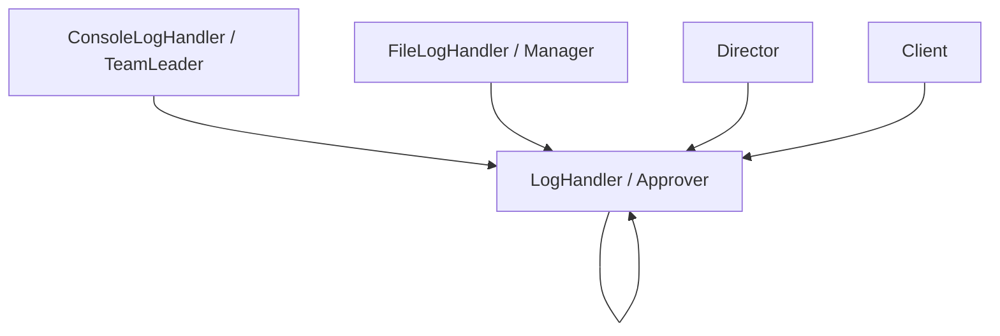

# 职责链模式（Chain of Responsibility）

## 1. UML 简图


---

## 2. 模式概述

- **分类**：行为型模式
- **意图**：使多个对象都有机会处理请求，将这些对象连成一条链，并沿着这条链传递请求，直到有对象处理它为止。
- **核心问题**：当需要为同一类请求配置一条“可扩展、可重排”的处理流水线时，如何在不修改客户端代码的前提下灵活增删、调整处理者。

---

## 3. 实现要点

- **实现要点**：
  - 1）在抽象处理者中统一维护 `next_` 指针和 `SetNext()` 接口，并在 `Handle()` 实现中封装“自己处理或交给下一个”的基本流程；
  - 2）在各个具体处理者中判断是否能处理当前请求，能处理则完成本节点逻辑，不能处理则简单调用基类的 `Handle()` 把请求传下去；
  - 3）由客户端在初始化阶段组装责任链结构（确定各处理者顺序），运行时只需把请求交给链头即可，新增处理节点时只需在链上插入新的处理者对象。

---

## 4. 结构与角色

- **Handler（抽象处理者）**：
  - 声明处理请求的接口 `Handle()`；
  - 持有下一个处理者指针 `next_`，并提供 `SetNext()` 接口。

- **ConcreteHandler（具体处理者）**：
  - 实现具体的处理逻辑；
  - 在无法处理时，将请求转发给链上的下一个处理者。

- **Client（客户端）**：
  - 负责组装处理链的结构（确定顺序）；
  - 将请求交给链头，无需关心链上有多少节点、谁最终处理了请求。

---

## 5. 本目录代码结构说明

- `ChainOfResponsibility.h`：
  - 示例 1：日志处理链（LogLevel）
    - 定义日志级别枚举 `LogLevel`；
    - 定义抽象处理者 `LogHandler` 以及 `ConsoleLogHandler`、`FileLogHandler` 等具体处理者；
    - 通过不同级别的阈值，决定哪些日志在控制台输出、哪些写入“文件”（示例中用 `std::cout` 代替文件）；
  - 示例 2：请假审批链（LeaveRequest）
    - 定义请假请求结构体 `LeaveRequest`；
    - 定义 `Approver` 抽象类及 `TeamLeader`、`Manager`、`Director` 等具体审批人；
    - 根据请假天数不同，决定由谁审批；
  - 提供演示函数：
    - `RunLogChainDemo()`；
    - `RunLeaveApprovalDemo()`；
- `main.cpp`：
  - 只负责调用上述两个演示函数。

---

## 64. 多种用法与设计思想

### 6.1 日志处理链

- 客户端可以根据需要将多个日志处理器串成链，例如：
  - Debug/Info 日志只在控制台输出；
  - Warn/Error 级别日志同时在控制台和“文件”中记录；
- 当新增一种日志存储方式（如远程日志服务器）时，只需新增一个处理者类并挂到链上即可。

### 6.2 请假审批链

- 将业务规则“几天以内由谁审批”封装到各级审批者内部；
- 当组织结构变化（增加/删除某一级审批）时，只需要调整链的结构即可，客户端调用方式不变。

---

## 7. 典型适用场景

- 日志处理、过滤器链、拦截器链；
- Web 框架中的请求处理流水线（鉴权、限流、参数校验、业务处理等）；
- 审批流程、责任分派等业务场景。

---

## 8. 如何运行本示例

```bash
cd DesignPatterns/behavioral/chain_of_responsibility

# 使用 g++ 手动编译
g++ -std=c++17 -O2 -Wall -Wextra main.cpp -o chain_of_responsibility_example
./chain_of_responsibility_example

# 或在工程根目录使用 CMake 统一构建，然后运行
#   build/chain_of_responsibility_example
```

## 9. 运行结果示例

```
--- Log Chain Demo ---
[Console] This is an info message
[Console] This is a warn message
[File] This is a warn message
[Console] This is an error message
[File] This is an error message

--- Leave Approval Chain Demo ---
TeamLeader Zhang approved leave for Alice (1 days)
Manager Li approved leave for Bob (2 days)
Director Wang approved leave for Cindy (5 days)
```

## 10. 测试用例

本职责链模式包含以下测试用例：

- `test_chain_of_responsibility.cpp`：测试日志链和审批链
- 验证请求正确传递
- 测试链式处理的正确性
- 验证请求被适当处理或拒绝

运行测试：
```bash
# 在项目根目录运行
./scripts/run_tests.sh
# 或运行特定测试
./build/chain_of_responsibility_test
```
