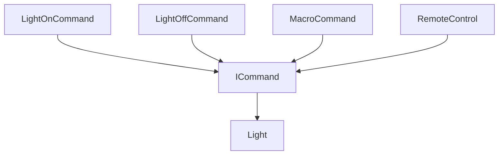

# 命令模式（Command）

## 1. UML 简图


---

## 2. 模式概述

- **分类**：行为型模式
- **意图**：将“请求”封装为对象，从而使你可用不同的请求、队列或日志来参数化其他对象，并支持可撤销操作。
- **核心问题**：如何把“请求的发起者”与“请求的执行者”解耦，同时为请求增加排队、撤销、重做等能力。

---

## 3. 实现要点

- **实现要点**：
  - 1）定义统一的命令接口 `ICommand`，封装执行和可选撤销操作，使“请求”本身可以被对象化和记录；
  - 2）在具体命令类中持有接收者（如 `Light`）指针，将 `Execute()` 实现为对接收者具体方法的调用，实现“调用者只依赖命令、不依赖接收者”；
  - 3）在调用者（如 `RemoteControl`、`MacroCommand`）中维护命令对象或命令列表，根据需要执行、排队或撤销命令，为后续扩展日志、持久化等能力打基础。

---

## 4. 结构与角色

- **Command（命令接口）**：
  - 声明执行操作的接口 `Execute()`（以及可选的 `Undo()`）。

- **ConcreteCommand（具体命令）**：
  - 持有对接收者（Receiver）的引用；
  - 在 `Execute()` 中调用接收者的相应方法，实现真正的业务操作。

- **Receiver（接收者）**：
  - 执行实际业务逻辑的对象，例如文档、设备、业务服务等。

- **Invoker（调用者）**：
  - 只依赖命令接口，在合适的时机调用 `Execute()`；
  - 可以维护命令队列或命令历史，用于支持批量执行、宏命令、撤销/重做等功能。

---

## 5. 本目录代码结构说明

- `Command.h`：
  - 示例 1：简单命令
    - `Light` 作为接收者，命令包括 `LightOnCommand`、`LightOffCommand`；
    - `RemoteControl` 作为调用者，绑定命令并触发执行；
  - 示例 2：宏命令 + 撤销
    - 定义 `MacroCommand`，内部持有多个命令并依次执行；
    - 为命令接口添加 `Undo()`，示例中提供简单撤销逻辑；
  - 提供演示函数：
    - `RunSimpleCommandDemo()`；
    - `RunMacroCommandDemo()`。
- `main.cpp`：
  - 只负责调用上述两个演示函数。

---

## 6. 多种用法与设计思想

### 6.1 简单命令

在 `RunSimpleCommandDemo()` 中：

- 客户端将 `LightOnCommand` 和 `LightOffCommand` 分别绑定到 `RemoteControl` 的按钮上；
- 按下不同按钮即可触发不同命令，遥控器无需知道 `Light` 的实现细节；
- 体现了“命令调用方与执行方解耦”。

### 6.2 宏命令与撤销

在 `RunMacroCommandDemo()` 中：

- 创建一组命令（如开灯 + 关灯，再加其它操作），放入 `MacroCommand` 中；
- 一次调用 `Execute()` 即可顺序执行多个子命令；
- 通过 `Undo()` 可以按相反顺序撤销子命令（示例中给出简单实现）。

---

## 7. 典型适用场景

- GUI 按钮、菜单与业务逻辑解耦；
- 任务队列、作业调度系统；
- 撤销/重做功能（编辑器、IDE 等）；
- 远程调用和操作日志记录（命令对象可以序列化、持久化）。

---

## 8. 如何运行本示例

```bash
cd DesignPatterns/behavioral/command

# 使用 g++ 手动编译
g++ -std=c++17 -O2 -Wall -Wextra main.cpp -o command_example
./command_example

# 或在工程根目录使用 CMake 统一构建，然后运行
#   build/command_example
```

## 9. 运行结果示例

```
--- Simple Command Demo ---
Light is ON
Light is OFF
Light is OFF
Light is ON

--- Macro Command Demo ---
Light is ON
Light is OFF
Light is ON
Light is OFF
```

## 10. 测试用例

本命令模式包含以下测试用例：

- `test_command.cpp`：测试简单命令和宏命令
- 验证命令执行的正确性
- 测试宏命令的批量执行
- 验证撤销功能（如果有实现）

运行测试：
```bash
# 在项目根目录运行
./scripts/run_tests.sh
# 或运行特定测试
./build/command_test
```
