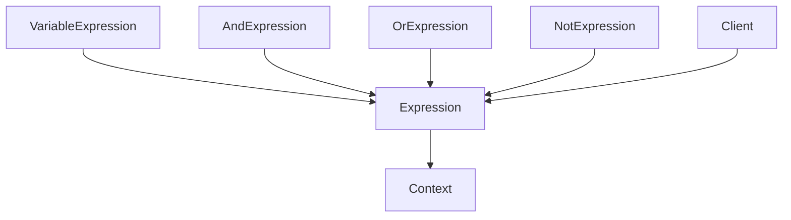

# 解释器模式（Interpreter）

## 1. UML 简图


---

## 2. 模式概述

- **分类**：行为型模式
- **意图**：给定一种语言，定义它的文法的一种表示，并定义一个解释器，这个解释器使用该表示来解释语言中的句子。
- **核心问题**：当某个领域需要频繁对“简单而固定文法”的表达式进行解析和求值时，如何通过面向对象的方式优雅地表示和解释这些表达式。

在实际项目中，大部分时候会使用成熟的解析器/脚本引擎；解释器模式更适合**小型 DSL（领域特定语言）**或教学演示。

---

## 3. 实现要点

- **实现要点**：
  - 1）先定义统一的抽象表达式接口 `Expression`，声明 `Interpret(Context&)` 等求值方法；
  - 2）为变量、常量等实现终结符表达式类，为逻辑运算/算术运算实现非终结符表达式类，通过组合这些对象构建语法树；
  - 3）在解释阶段，从根表达式出发递归调用子表达式的 `Interpret()`，利用 `Context` 提供的环境信息计算整个表达式的值。

---

## 4. 结构与角色

- **AbstractExpression（抽象表达式）**：
  - 声明解释操作 `Interpret(Context&)` 接口；

- **TerminalExpression（终结符表达式）**：
  - 表示文法中的终结符，如变量、常量等；

- **NonterminalExpression（非终结符表达式）**：
  - 表示由其他表达式组合而成的复杂表达式，如加法、减法等；

- **Context（上下文）**：
  - 提供解释时需要的全局信息，如环境变量映射等。

---

## 5. 本目录代码结构说明

- `Interpreter.h`：
  - 示例 1：布尔表达式解释器
    - 语言示例：`"A AND B"`、`"A OR (B AND C)"`（本例简化为代码直接构建语法树）；
    - `Context` 保存变量名到布尔值的映射；
    - 表达式类：`Expression`、`VariableExpression`、`AndExpression`、`OrExpression`、`NotExpression`；
  - 示例 2：简单算术表达式（只演示加法链表，如 `1 + 2 + 3`）
    - 用链式结构组合多个 `NumberExpression`；
  - 提供演示函数：
    - `RunBooleanInterpreterDemo()`；
    - `RunArithmeticInterpreterDemo()`。
- `main.cpp`：
  - 只负责调用上述两个演示函数。

---

## 6. 多种用法与设计思想

### 6.1 布尔表达式解释器

- 通过组合不同的表达式类构建表达式树；
- 解释时，递归调用子表达式的 `Interpret(context)`，利用 `Context` 中的变量取值进行运算；
- 适合：权限规则、过滤条件等简单逻辑表达式。

### 6.2 简单算术表达式

- 用链式非终结符表达式表示 `a + b + c`；
- 虽然不如生成 AST 那样完整，但适合理解解释器模式的“组合 + 递归解释”思想。

---

## 7. 典型适用场景

- 简单规则引擎、小型 DSL（如日志过滤表达式）；
- 简化版查询语言、配置脚本；
- 教学中解释语法树和递归下降解析的例子。

> 注意：对于复杂语言，解释器模式会导致类数量爆炸，通常应使用专门的解析工具或脚本语言。

---

## 8. 如何运行本示例

```bash
cd DesignPatterns/behavioral/interpreter

# 使用 g++ 手动编译
g++ -std=c++17 -O2 -Wall -Wextra main.cpp -o interpreter_example
./interpreter_example

# 或在工程根目录使用 CMake 统一构建，然后运行
#   build/interpreter_example
```

## 9. 运行结果示例

```
--- Boolean Interpreter Demo ---
Expression A AND (B OR C) = true

--- Arithmetic Interpreter Demo ---
Expression 1 + (2 + 3) = 6
```

## 10. 测试用例

本解释器模式包含以下测试用例：

- `test_interpreter.cpp`：测试布尔和算术表达式解释器
- 验证表达式解释的正确性
- 测试复合表达式的解析
- 验证上下文变量的使用

运行测试：
```bash
# 在项目根目录运行
./scripts/run_tests.sh
# 或运行特定测试
./build/interpreter_test
```
