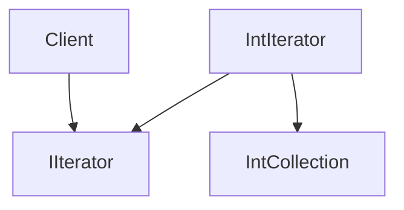

# 迭代器模式（Iterator）

## 1. UML 简图


---

## 2. 模式概述

- **分类**：行为型模式
- **意图**：提供一种方法顺序访问聚合对象中的各个元素，而又不暴露其内部表示。
- **核心问题**：当需要遍历自定义数据结构时，如何将遍历逻辑从容器实现中解耦，使客户端可以统一使用“迭代器接口”进行访问。

在 C++ 中，STL 已经广泛使用迭代器思想，本示例通过自定义容器演示迭代器模式的实现方式。

---

## 3. 实现要点

- **实现要点**：
  - 1）在迭代器接口 `IIterator` 中统一声明遍历方法（如 `HasNext()`、`Next()`、`Current()`），将遍历状态从聚合对象中抽离出来；
  - 2）在具体迭代器 `IntIterator` 中持有对聚合对象的引用以及当前位置索引，所有遍历逻辑都封装在迭代器内部；
  - 3）聚合类 `IntCollection` 提供创建迭代器的方法，客户端只通过迭代器顺序访问元素，而无需关心容器内部是否使用 `std::vector` 或其他数据结构。

---

## 4. 结构与角色

- **Iterator（迭代器接口）**：
  - 声明遍历聚合对象的接口：如 `HasNext()`、`Next()`、`Current()`；

- **ConcreteIterator（具体迭代器）**：
  - 持有对具体聚合对象的引用，以及当前遍历位置；

- **Aggregate（聚合接口）**：
  - 声明创建迭代器的接口，如 `CreateIterator()`；

- **ConcreteAggregate（具体聚合）**：
  - 存储元素数据结构，并实现创建具体迭代器的方法。

---

## 5. 本目录代码结构说明

- `Iterator.h`：
  - 示例 1：自定义顺序容器 + 前向迭代器
    - `IntCollection` 自定义容器，内部使用 `std::vector<int>` 存储；
    - `IntIterator` 实现简单的前向迭代；
  - 示例 2：只读迭代与可修改迭代（示意）
    - 区分返回 `const int&` 与 `int&` 的迭代接口；
  - 提供演示函数：
    - `RunIteratorDemo()`。
- `main.cpp`：
  - 只负责调用演示函数。

---

## 6. 多种用法与设计思想

### 6.1 前向迭代

- 提供简单的 `HasNext()` / `Next()` 接口，按顺序访问容器中的每个元素；
- 客户端无需了解内部是 `std::vector` 还是其他结构。

### 6.2 读写区分

- 示例中演示了只读访问与可修改访问的接口差异；
- 在真实项目中，可以通过 `const` 迭代器与非 `const` 迭代器区分读写。

---

## 7. 典型适用场景

- 为自定义容器提供统一的遍历接口；
- 需要支持多种遍历方式（顺序、逆序、按某种过滤规则等）；
- 希望隐藏聚合对象的内部结构，降低耦合。

---

## 8. 如何运行本示例

```bash
cd DesignPatterns/behavioral/iterator

# 使用 g++ 手动编译
g++ -std=c++17 -O2 -Wall -Wextra main.cpp -o iterator_example
./iterator_example

# 或在工程根目录使用 CMake 统一构建，然后运行
#   build/iterator_example
```

## 9. 运行结果示例

```
--- Iterator Demo ---
Before: 1, After: 11
Before: 2, After: 12
Before: 3, After: 13
```

## 10. 测试用例

本迭代器模式包含以下测试用例：

- `test_iterator.cpp`：测试自定义迭代器
- 验证迭代器的遍历功能
- 测试HasNext和Next方法
- 验证元素访问的正确性

运行测试：
```bash
# 在项目根目录运行
./scripts/run_tests.sh
# 或运行特定测试
./build/iterator_test
```
