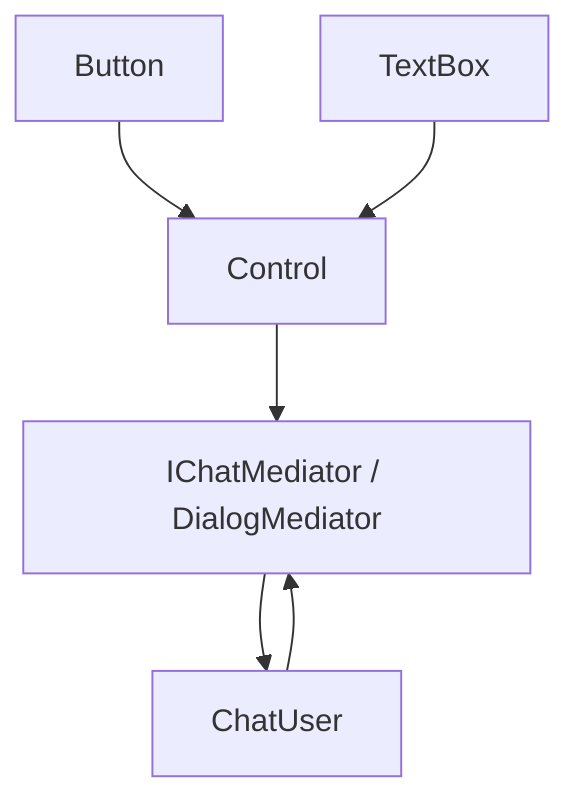

# 中介者模式（Mediator）

## 1. UML 简图


---

## 2. 模式概述

- **分类**：行为型模式
- **意图**：用一个中介对象来封装一系列对象交互，使各对象不再显式引用，从而降低它们之间的耦合度。
- **核心问题**：当多个对象之间存在复杂交互关系时，如果它们彼此直接引用，会形成网状依赖，难以维护；中介者模式通过“中心协调者”简化对象之间的通信。

---

## 3. 实现要点

- **实现要点**：
  - 1）为不同场景抽象出中介者接口（如聊天室的 `IChatMediator`、对话框的 `DialogMediator`），约定统一的消息转发入口；
  - 2）在具体中介者中维护同事对象列表，并在收到单个同事的通知时，根据业务规则决定转发给哪些其他同事；
  - 3）在各个同事类中持有中介者指针，所有对外通信都通过中介者完成，从而避免同事之间直接互相引用形成网状依赖。

---

## 4. 结构与角色

- **Mediator（中介者接口）**：
  - 声明用于在同事对象之间转发消息的方法，如 `Send()`。

- **ConcreteMediator（具体中介者）**：
  - 持有对多个同事对象的引用；
  - 实现协调逻辑：决定将某个同事发出的消息转发给哪些其他同事。

- **Colleague（同事抽象类）**：
  - 持有中介者引用；
  - 对外通过中介者发送消息，对内通过中介者回调接收消息。

- **ConcreteColleague（具体同事类）**：
  - 实现具体行为，在需要交互时通过中介者进行通信。

---

## 5. 本目录代码结构说明

- `Mediator.h`：
  - 示例 1：聊天室
    - 中介者：`ChatRoomMediator`；
    - 同事：`User`，通过中介者向其他用户发送消息；
  - 示例 2：对话框中控件协作（简化）
    - 中介者：`DialogMediator`；
    - 同事：`Button`、`TextBox` 等控件，演示当某个控件状态变化时，如何通知其他控件。
  - 提供演示函数：
    - `RunChatRoomMediatorDemo()`；
    - `RunDialogMediatorDemo()`。
- `main.cpp`：
  - 只负责调用上述两个演示函数。

---

## 6. 多种用法与设计思想

### 6.1 聊天室示例

- 多个 `User` 彼此之间不直接引用对方；
- 发送消息时只调用 `mediator->Send(this, message)`；
- 由 `ChatRoomMediator` 决定把消息转发给哪些用户（示例中广播给所有人）。

### 6.2 对话框控件协作示例

- 当某个控件（按钮、文本框）状态改变时，通过中介者通知其它控件；
- 控件之间不直接依赖，减少 UI 控件的相互引用和耦合。

---

## 7. 典型适用场景

- GUI 对话框/窗口中各种控件的复杂联动；
- 聊天室、消息路由器、事件中枢；
- 任何“多对象互相通知”的场景，都可以考虑通过中介者集中管理。

---

## 8. 如何运行本示例

```bash
cd DesignPatterns/behavioral/mediator

# 使用 g++ 手动编译
g++ -std=c++17 -O2 -Wall -Wextra main.cpp -o mediator_example
./mediator_example

# 或在工程根目录使用 CMake 统一构建，然后运行
#   build/mediator_example
```

## 9. 运行结果示例

```
--- Chat Room Mediator Demo ---
Alice sends: Hello everyone!
Bob receives from Alice: Hello everyone!
Cindy receives from Alice: Hello everyone!
Bob sends: Hi Alice!
Alice receives from Bob: Hi Alice!
Cindy receives from Bob: Hi Alice!

--- Dialog Mediator Demo ---
TextBox text set to: admin
DialogMediator: username changed, enable login button
Button clicked
```

## 10. 测试用例

本中介者模式包含以下测试用例：

- `test_mediator.cpp`：测试聊天室和对话框中介者
- 验证中介者转发消息的正确性
- 测试同事对象之间的交互
- 验证解耦效果

运行测试：
```bash
# 在项目根目录运行
./scripts/run_tests.sh
# 或运行特定测试
./build/mediator_test
```
