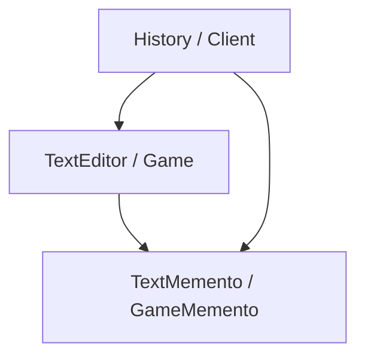

# 备忘录模式（Memento）

## 1. UML 简图


---

## 2. 模式概述

- **分类**：行为型模式
- **意图**：在不破坏封装性的前提下，捕获一个对象的内部状态，并在该对象之外保存这个状态，以便以后恢复到原先的状态。
- **核心问题**：如何在不暴露对象内部实现细节的情况下，实现撤销、回滚等功能。

---

## 3. 实现要点

- **实现要点**：
  - 1）在发起人类（如 `TextEditor`、`Game`）中提供 `Save()` / `Restore()` 接口，用于创建和应用备忘录；
  - 2）在备忘录类中保存需要恢复的内部状态字段，对外可以只暴露给发起人访问，避免破坏封装；
  - 3）由管理者（如 `History`）维护一个备忘录栈或列表，在关键节点保存快照，在需要撤销或回滚时把相应备忘录交回发起人恢复状态。

---

## 4. 结构与角色

- **Originator（发起人）**：
  - 需要被保存/恢复状态的对象；
  - 能够创建/恢复备忘录对象。

- **Memento（备忘录）**：
  - 存储 Originator 的内部状态；
  - 对外通常是一个不透明对象，避免外部直接修改内部状态。

- **Caretaker（管理者）**：
  - 负责保存和管理备忘录（可以是栈/列表等）；
  - 不对备忘录内容进行操作，只在需要时将其交回给 Originator 恢复。

---

## 5. 本目录代码结构说明

- `Memento.h`：
  - 示例 1：文本编辑器撤销
    - `TextEditor` 作为 Originator，内部维护文本内容；
    - `TextMemento` 存储文本快照；
    - `History` 作为管理者，提供 `Undo()` 功能；
  - 示例 2：游戏存档（简化）
    - `Game` 作为 Originator，包含关卡、生命值等状态；
    - `GameMemento` 用于保存/恢复游戏状态；
  - 提供演示函数：
    - `RunTextEditorMementoDemo()`；
    - `RunGameMementoDemo()`。
- `main.cpp`：
  - 只负责调用上述演示函数。

---

## 6. 多种用法与设计思想

### 6.1 文本编辑器撤销

- 每当文本内容发生改变时，创建一个备忘录压入历史栈；
- 撤销时，从栈顶弹出一个备忘录，让 `TextEditor` 恢复到该状态；
- 外部代码无需访问 `TextEditor` 的内部表示。

### 6.2 游戏存档

- 可以在关键节点（如通过一关）时保存一个 `GameMemento`；
- 在玩家失败时，将游戏恢复到最近的存档状态；
- 更复杂的系统可以支持多存档槽位、自动存档等。

---

## 7. 典型适用场景

- 文本编辑器/IDE 中的撤销、重做功能；
- 游戏存档、配置快照；
- 需要在运行过程中临时保存和恢复对象状态的场景（如事务回滚模拟等）。

---

## 8. 如何运行本示例

```bash
cd DesignPatterns/behavioral/memento

# 使用 g++ 手动编译
g++ -std=c++17 -O2 -Wall -Wextra main.cpp -o memento_example
./memento_example

# 或在工程根目录使用 CMake 统一构建，然后运行
#   build/memento_example
```

## 9. 运行结果示例

```
--- Text Editor Memento Demo ---
TextEditor text set to: Version 1
TextEditor text set to: Version 2
TextEditor text set to: Version 3
TextEditor restored to: Version 2
TextEditor restored to: Version 1

--- Game Memento Demo ---
Game: level = 2, hp = 90
Game: level = 3, hp = 80
Game restored to level = 1, hp = 100
```

## 10. 测试用例

本备忘录模式包含以下测试用例：

- `test_memento.cpp`：测试文本编辑器和游戏备忘录
- 验证状态保存和恢复功能
- 测试撤销功能
- 验证封装性保护

运行测试：
```bash
# 在项目根目录运行
./scripts/run_tests.sh
# 或运行特定测试
./build/memento_test
```
