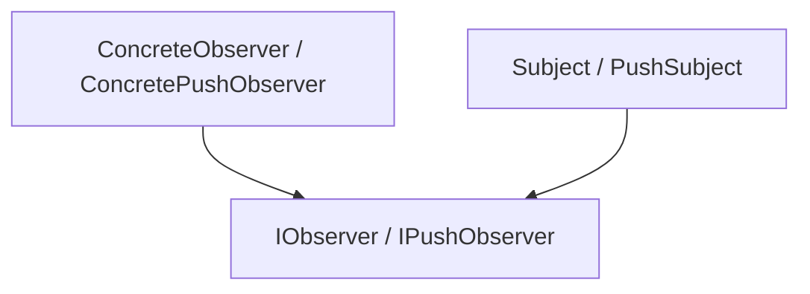

# 观察者模式（Observer）

## 1. UML 简图


---

## 2. 模式概述

- **分类**：行为型模式
- **意图**：定义对象间的一对多依赖关系，当一个对象状态发生改变时，所有依赖它的对象都会得到通知并自动更新。
- **核心问题**：当多个对象需要“订阅”某个对象的状态变化时，如何在不强耦合的情况下实现通知机制。

---

## 3. 实现要点

- **实现要点**：
  - 1）在主题类中维护观察者列表并提供 `Attach()` / `Detach()` / `Notify()` 等方法，统一管理订阅关系；
  - 2）定义观察者接口，在 `Update()` 中约定拉模型或推模型的参数形式，具体观察者根据需要从主题拉取数据或处理推送的数据；
  - 3）业务代码只需在主题状态变化时调用 `Notify()`，新增观察者只需实现接口并注册到主题，无需修改主题内部逻辑。

---

## 4. 结构与角色

- **Subject（主题/被观察者）**：
  - 维护一组观察者；
  - 提供注册、注销、通知方法；

- **Observer（观察者接口）**：
  - 定义在主题发生变化时要执行的更新方法，如 `Update()`；

- **ConcreteSubject（具体主题）**：
  - 保存具体状态；
  - 在状态变化时调用 `Notify()` 通知所有观察者。

- **ConcreteObserver（具体观察者）**：
  - 实现 `Update()`，在收到通知时从主题拉取/接收所需数据并执行相应逻辑。

---

## 5. 本目录代码结构说明

- `Observer.h`：
  - 示例 1：拉模型（Pull Model）
    - 主题：`Subject` 保存状态 `int state_`；
    - 观察者：`ConcreteObserver` 在 `Update()` 中通过主题接口获取状态；
  - 示例 2：推模型（Push Model）
    - 主题在通知时直接将新状态作为参数推送给观察者；
  - **示例 3：线程安全版本**（C++17+）
    - 使用 `std::shared_mutex` 实现读写锁
    - 使用 `std::weak_ptr` 避免循环引用
    - 复制列表后通知，避免长时间持锁
  - 提供演示函数：
    - `RunPullObserverDemo()`；
    - `RunPushObserverDemo()`；
    - `RunThreadSafeObserverDemo()`。
- `main.cpp`：
  - 只负责调用上述演示函数。

---

## 6. 线程安全与性能优化

### 6.1 线程安全问题分析

观察者模式是**最需要关注线程安全**的设计模式之一：

1. **观察者列表的并发修改**
   - 多个线程同时添加/删除观察者
   - 通知过程中观察者自我注销导致迭代器失效
   - 需要保护观察者列表的完整性

2. **死锁风险**
   - 观察者在 `Update()` 中反向调用主题方法
   - 如果主题和观察者都持有锁，可能产生死锁
   - 解决：在锁外进行通知

3. **内存泄漏**
   - 主题持有观察者的 `shared_ptr` 导致循环引用
   - 使用 `weak_ptr` 打破循环引用

4. **通知顺序和一致性**
   - 通知过程中状态再次变化
   - 需要确保观察者看到一致的状态

### 6.2 线程安全实现方案

#### 方案1：使用读写锁（推荐）

```cpp
class ThreadSafeSubject {
public:
    void Attach(std::weak_ptr<IObserver> obs) {
        std::unique_lock<std::shared_mutex> lock(mutex_);
        observers_.push_back(std::move(obs));
    }
    
    void Notify() {
        // 复制列表，避免长时间持锁
        std::vector<std::weak_ptr<IObserver>> copy;
        {
            std::shared_lock<std::shared_mutex> lock(mutex_);
            copy = observers_;
        }
        
        // 在锁外通知，避免死锁
        for (auto& wp : copy) {
            if (auto obs = wp.lock()) {
                obs->Update(state_);
            }
        }
    }
    
private:
    mutable std::shared_mutex mutex_; // C++17
    std::vector<std::weak_ptr<IObserver>> observers_;
};
```

**优点**：
- 多个线程可以并发读取观察者列表
- 只有添加/删除时需要写锁
- 性能优于简单互斥锁

#### 方案2：使用 weak_ptr 避免循环引用

```cpp
// 观察者继承 enable_shared_from_this
class Observer : public std::enable_shared_from_this<Observer> {
public:
    void SubscribeTo(Subject& subject) {
        subject.Attach(weak_from_this());
    }
};
```

**优点**：
- 自动清理已销毁的观察者
- 避免内存泄漏
- 支持观察者自主销毁

#### 方案3：异步通知（高性能）

```cpp
void NotifyAsync() {
    std::vector<std::weak_ptr<IObserver>> copy;
    {
        std::shared_lock<std::shared_mutex> lock(mutex_);
        copy = observers_;
    }
    
    // 异步通知，不阻塞主题
    std::thread([copy = std::move(copy), state = state_]() {
        for (auto& wp : copy) {
            if (auto obs = wp.lock()) {
                obs->Update(state);
            }
        }
    }).detach();
}
```

### 6.3 性能优化建议

1. **批量通知**
   - 累积多次状态变化，一次性通知
   - 减少锁开销和通知次数

2. **观察者优先级**
   - 为观察者分配优先级
   - 高优先级观察者优先通知

3. **条件通知**
   - 只通知关心特定状态变化的观察者
   - 减少不必要的通知

4. **定期清理过期观察者**
   ```cpp
   void RemoveExpiredObservers() {
       std::unique_lock<std::shared_mutex> lock(mutex_);
       observers_.erase(
           std::remove_if(observers_.begin(), observers_.end(),
               [](const auto& wp) { return wp.expired(); }),
           observers_.end()
       );
   }
   ```

### 6.4 C++ 标准版本特性

#### C++11
- ✅ `std::shared_ptr`、`std::weak_ptr`
- ✅ `std::enable_shared_from_this`
- ✅ `std::mutex`、`std::lock_guard`
- ✅ Lambda 表达式用于回调

#### C++14
- ✅ `std::make_unique`
- ✅ 泛型 lambda

#### C++17
- ✅ **std::shared_mutex**（读写锁，性能优化关键）
  ```cpp
  std::shared_lock<std::shared_mutex> readLock(mutex_);  // 读锁
  std::unique_lock<std::shared_mutex> writeLock(mutex_); // 写锁
  ```
- ✅ 结构化绑定

#### C++20
- ✅ **协程**实现异步观察者
  ```cpp
  Task<void> AsyncObserver::Update(int state) {
      co_await ProcessState(state);
  }
  ```
- ✅ `std::jthread` 自动 join
- ✅ `std::atomic` 改进

#### C++23
- ✅ `std::expected` 错误处理
- ✅ 更好的协程支持

---

## 7. 多种用法与设计思想

### 7.1 拉模型

- 主题只负责通知“有变化”，不推送具体数据；
- 观察者在 `Update()` 中向主题查询当前状态；
- 优点：主题与观察者解耦，不关心观察者需要什么数据；
- 缺点：观察者可能会多次访问主题，存在一定性能开销。

### 7.2 推模型

- 主题在通知时直接把新状态或部分数据推给观察者；
- 观察者在 `Update(int newState)` 中处理数据，无需再访问主题；
- 优点：通知粒度更细，观察者访问主题次数更少；
- 缺点：主题需要知道要推哪些数据，耦合略强。

---

## 8. 典型适用场景

- GUI 事件系统、订阅-发布模型；
- 配置变更通知、数据绑定；
- 日志、监控、告警系统中的事件订阅。

---

## 9. 如何运行本示例

```bash
cd DesignPatterns/behavioral/observer

# 使用 g++ 手动编译
g++ -std=c++17 -O2 -Wall -Wextra main.cpp -o observer_example
./observer_example

# 或在工程根目录使用 CMake 统一构建，然后运行
#   build/observer_example
```

## 10. 运行结果示例

```
--- Pull Observer Demo ---
Observer1 observed new state: 10
Observer2 observed new state: 10
Observer1 observed new state: 20
Observer2 observed new state: 20

--- Push Observer Demo ---
PushObserver1 got pushed state: 100
PushObserver2 got pushed state: 100
PushObserver1 got pushed state: 200
PushObserver2 got pushed state: 200
```

## 11. 测试用例

本观察者模式包含以下测试用例：

- `test_observer.cpp`：测试拉模型、推模型和线程安全版本的观察者
- 验证观察者能够正确接收到主题的通知
- 测试观察者的注册和注销功能
- 验证线程安全的观察者管理
- 测试多线程环境下的正确性

运行测试：
```bash
# 在项目根目录运行
./scripts/run_tests.sh
# 或运行特定测试
./build/observer_test
```
