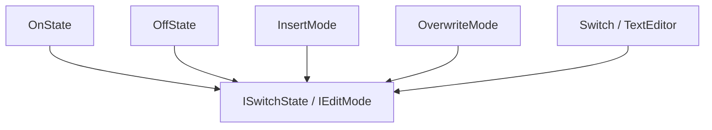

# 状态模式（State）

## 1. UML 简图


---

## 2. 模式概述

- **分类**：行为型模式
- **意图**：允许对象在内部状态改变时改变它的行为，看起来好像修改了它的类。
- **核心问题**：当一个对象的行为取决于其内部状态，并且它必须在运行时根据状态改变行为时，如何避免在对象内部充斥大量 `if-else`/`switch` 状态判断。

---

## 3. 实现要点

- **实现要点**：
  - 1）抽象出状态接口（如 `ISwitchState`、`IEditMode`），把与状态相关的行为从上下文类中剥离出来；
  - 2）为每种具体状态实现对应的状态类，在合适时机通过修改上下文持有的状态指针来完成状态切换；
  - 3）上下文对外只暴露统一接口（如 `Press()`、`InsertChar()`），内部将请求委托给当前状态对象处理，从而消除大量 `if/else` 或 `switch` 分支判断。

---

## 4. 结构与角色

- **State（状态接口）**：
  - 声明状态对应的行为接口，例如 `Handle()` 或者若干与状态相关的操作；

- **ConcreteState（具体状态类）**：
  - 实现该状态下的特定行为；
  - 在适当时机将上下文切换到另一个具体状态；

- **Context（上下文）**：
  - 持有当前状态对象的引用；
  - 客户端只与 `Context` 打交道，由 `Context` 将请求委托给当前状态对象。

---

## 5. 本目录代码结构说明

- `State.h`：
  - 示例 1：简单开关（On/Off）
    - `State` 接口和 `OnState`、`OffState` 两个具体状态；
    - `Switch` 作为上下文，通过 `Press()` 在 On/Off 状态之间切换；
  - 示例 2：文本编辑器模式（插入/覆盖）
    - `TextEditor` 上下文 + `InsertMode` / `OverwriteMode` 两种模式；
  - 提供演示函数：
    - `RunSimpleStateDemo()`；
    - `RunTextEditorStateDemo()`。
- `main.cpp`：
  - 只负责调用上述演示函数。

---

## 6. 多种用法与设计思想

### 6.1 简单开关

- 用两个状态对象（On/Off）替代 `bool` + 大量条件判断；
- 状态对象内部决定下一个状态，将切换逻辑封装在状态类中。

### 6.2 文本编辑器模式

- 在插入模式下，在光标位置插入字符；
- 在覆盖模式下，覆盖当前字符；
- 状态对象封装具体行为，`TextEditor` 本身只负责维护文本和光标位置，并委托给当前模式。

---

## 7. 典型适用场景

- 有限状态机（FSM）：如 TCP 连接状态、订单状态、工作流状态；
- GUI 控件状态（普通、悬停、按下、禁用等）；
- 模式切换逻辑较复杂时，通过状态类把复杂度从 `Context` 转移出去。

---

## 8. 如何运行本示例

```bash
cd DesignPatterns/behavioral/state

# 使用 g++ 手动编译
g++ -std=c++17 -O2 -Wall -Wextra main.cpp -o state_example
./state_example

# 或在工程根目录使用 CMake 统一构建，然后运行
#   build/state_example
```

## 9. 运行结果示例

```
--- Simple State Demo ---
Switch is currently: OFF, press...
Turning ON
Switch is currently: ON, press...
Turning OFF

--- TextEditor State Demo ---
Text = 'ABC', cursor = 3, mode = Insert
Text = 'AXC', cursor = 2, mode = Overwrite
```

## 10. 测试用例

本状态模式包含以下测试用例：

- `test_state.cpp`：测试开关和文本编辑器状态
- 验证状态转换的正确性
- 测试不同状态下行为的差异
- 验证状态模式封装状态相关行为

运行测试：
```bash
# 在项目根目录运行
./scripts/run_tests.sh
# 或运行特定测试
./build/state_test
```
