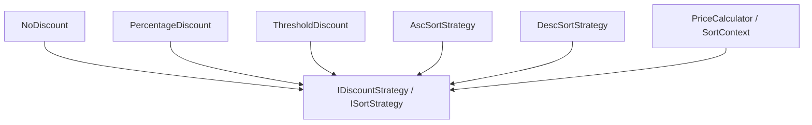

# 策略模式（Strategy）

## 1. UML 简图


---

## 2. 模式概述

- **分类**：行为型模式
- **意图**：定义一系列算法，把它们一个个封装起来，并且使它们可以互相替换，使得算法可以独立于使用它的客户端变化。
- **核心问题**：当存在多种算法可选（如不同排序方式、不同折扣计算方式）时，如何在不修改客户端代码的情况下灵活切换算法。

---

## 3. 实现要点

- **实现要点**：
  - 1）抽象出策略接口（如 `IDiscountStrategy`、`ISortStrategy`），对外只暴露统一的算法入口函数；
  - 2）为每种算法实现一个具体策略类，把算法细节封装在类内部，避免算法逻辑散落在调用代码中；
  - 3）上下文类（如 `PriceCalculator`、`SortContext`）在运行时持有一个策略指针，通过构造函数或 setter 注入具体策略，实现不修改上下文代码就能灵活切换算法。

---

## 4. 结构与角色

- **Strategy（策略接口）**：
  - 声明算法接口，如 `Calculate()`、`Sort()` 等；

- **ConcreteStrategy（具体策略）**：
  - 实现不同的算法；

- **Context（上下文）**：
  - 持有策略接口引用；
  - 在需要时调用策略对象完成工作；
  - 可以在运行时切换不同策略。

---

## 5. 本目录代码结构说明

- `Strategy.h`：
  - 示例 1：折扣策略
    - 策略接口：`IDiscountStrategy`；
    - 具体策略：`NoDiscount`、`PercentageDiscount`、`ThresholdDiscount` 等；
    - 上下文：`PriceCalculator`，根据设置的策略计算实际价格；
  - 示例 2：排序策略（仅示意）
    - 策略接口：`ISortStrategy`，具体策略：升序/降序排序；
  - **示例 3：线程安全的策略切换**（C++17+）
    - 使用 `std::shared_mutex` 实现线程安全的策略管理
    - 多线程可并发执行策略，切换策略时互斥
  - **示例 4：无锁策略切换**（C++11+）
    - 使用 `std::atomic<std::shared_ptr>` 实现无锁策略切换
    - 性能最优，适用于高并发场景
  - 提供演示函数：
    - `RunDiscountStrategyDemo()`；
    - `RunSortStrategyDemo()`；
    - `RunThreadSafeStrategyDemo()`；
    - `RunLockFreeStrategyDemo()`。
- `main.cpp`：
  - 只负责调用上述演示函数。

---

## 6. 线程安全与性能优化

### 6.1 线程安全问题分析

策略模式中的主要线程安全问题：

1. **策略切换过程中的并发访问**
   - 一个线程正在执行策略，另一个线程切换策略
   - 可能导致执行一半的策略被销毁

2. **策略对象内部状态的线程安全**
   - 如果策略对象有状态，需要保护
   - 最好设计为无状态的策略

3. **策略工厂的线程安全**
   - 如果使用策略池或缓存
   - 需要同步策略对象的获取

### 6.2 线程安全实现方案

#### 方案1：读写锁方案（推荐）

```cpp
class ThreadSafeStrategyContext {
public:
    void SetStrategy(std::shared_ptr<IStrategy> strategy) {
        std::unique_lock<std::shared_mutex> lock(mutex_);
        strategy_ = std::move(strategy);
    }
    
    auto Execute(double value) const {
        std::shared_lock<std::shared_mutex> lock(mutex_);
        return strategy_ ? strategy_->Execute(value) : value;
    }
    
private:
    mutable std::shared_mutex mutex_; // C++17
    std::shared_ptr<IStrategy> strategy_;
};
```

**优点**：
- 多个线程可以并发执行策略
- 只有切换策略时需要写锁
- 适合读多写少的场景

#### 方案2：无锁方案（高性能）

```cpp
class LockFreeStrategyContext {
public:
    void SetStrategy(std::shared_ptr<IStrategy> strategy) {
        strategy_.store(strategy, std::memory_order_release);
    }
    
    auto Execute(double value) const {
        auto current = strategy_.load(std::memory_order_acquire);
        return current ? current->Execute(value) : value;
    }
    
private:
    std::atomic<std::shared_ptr<IStrategy>> strategy_;
};
```

**优点**：
- 无锁设计，性能最优
- C++20 中 `std::atomic<std::shared_ptr>` 特化提供更好支持
- 适合高并发场景

### 6.3 性能优化建议

1. **策略对象设计为无状态**
   - 无状态策略可以安全地在多线程中共享
   - 不需要额外的同步开销

2. **策略对象缓存和复用**
   ```cpp
   // 策略工厂缓存常用策略
   class StrategyFactory {
       static std::shared_ptr<IStrategy> GetStrategy(const std::string& type) {
           static std::unordered_map<std::string, std::shared_ptr<IStrategy>> cache;
           static std::mutex mutex;
           
           std::lock_guard<std::mutex> lock(mutex);
           auto it = cache.find(type);
           if (it != cache.end()) return it->second;
           
           auto strategy = CreateStrategy(type);
           cache[type] = strategy;
           return strategy;
       }
   };
   ```

3. **使用函数对象替代类**
   ```cpp
   // C++11: 使用 std::function 简化设计
   class FunctionStrategyContext {
   public:
       using StrategyFunc = std::function<double(double)>;
       
       void SetStrategy(StrategyFunc func) {
           std::lock_guard<std::mutex> lock(mutex_);
           strategy_ = std::move(func);
       }
       
   private:
       std::mutex mutex_;
       StrategyFunc strategy_;
   };
   ```

4. **避免频繁切换策略**
   - 在合适的时机批量切换策略
   - 减少锁竞争和切换开销

### 6.4 C++ 标准版本特性

#### C++11
- ✅ `std::function` 和 lambda 表达式
- ✅ `std::atomic` 原子操作
- ✅ `std::mutex`、`std::lock_guard`
- ✅ 智能指针管理策略生命周期

#### C++14
- ✅ `std::make_unique`
- ✅ 泛型 lambda（auto 参数）
- ✅ auto 返回类型推导

#### C++17
- ✅ **std::shared_mutex**（读写锁）
  ```cpp
  std::shared_lock<std::shared_mutex> readLock(mutex_);  // 读锁
  std::unique_lock<std::shared_mutex> writeLock(mutex_); // 写锁
  ```
- ✅ `std::variant` 用于多策略类型
- ✅ `inline static` 简化静态成员

#### C++20
- ✅ **Concepts** 约束策略接口
  ```cpp
  template<typename T>
  concept DiscountStrategy = requires(T strategy, double price) {
      { strategy.Execute(price) } -> std::convertible_to<double>;
  };
  ```
- ✅ **std::atomic<std::shared_ptr>** 特化
- ✅ 协程实现异步策略

#### C++23
- ✅ 模式匹配优化策略选择
- ✅ `std::expected` 错误处理

---

## 7. 多种用法与设计思想

### 7.1 折扣策略

- 使用 `PriceCalculator` 持有当前折扣策略；
- 客户端可在运行时更换不同折扣算法，例如：无折扣、百分比折扣、满减折扣等；
- 新增折扣方式时，只需新增一个策略类即可。

### 7.2 排序策略

- 为同一组数据提供不同排序方式；
- 通过更换策略对象决定是升序还是降序，而客户端调用方式不变。

---

## 8. 典型适用场景

- 商城中的多种价格计算方式（促销策略、会员折扣、满减等）；
- 路由算法、路径查找算法等需要可插拔的地方；
- 可配置的策略选择（如配置文件/命令行决定使用哪种策略）。

---

## 9. 如何运行本示例

```bash
cd DesignPatterns/behavioral/strategy

# 使用 g++ 手动编译
g++ -std=c++17 -O2 -Wall -Wextra main.cpp -o strategy_example
./strategy_example

# 或在工程根目录使用 CMake 统一构建，然后运行
#   build/strategy_example
```

## 10. 运行结果示例

```
--- Discount Strategy Demo ---
NoDiscount: 100
20% off: 80
Full 150 minus 20: 100

--- Sort Strategy Demo ---
Asc: 1 2 3 4 5 
Desc: 5 4 3 2 1 
```

## 11. 测试用例

本策略模式包含以下测试用例：

- `test_strategy.cpp`：测试基本策略模式、线程安全策略和无锁策略
- 验证不同策略能够正确执行各自的算法
- 测试策略切换的正确性
- 验证线程安全的策略管理
- 测试无锁策略的性能优势

运行测试：
```bash
# 在项目根目录运行
./scripts/run_tests.sh
# 或运行特定测试
./build/strategy_test
```
