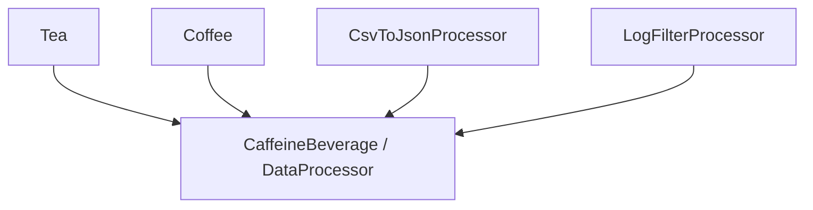

# 模板方法模式（Template Method）

## 1. UML 简图


---

## 2. 模式概述

- **分类**：行为型模式
- **意图**：定义一个操作中的算法骨架，而将一些步骤延迟到子类中，使得子类可以在不改变算法结构的情况下重新定义该算法的某些特定步骤。
- **核心问题**：当某个流程整体步骤固定，但部分步骤的具体实现会因实际需求不同而发生变化时，如何复用流程结构、保留可扩展点。

---

## 3. 实现要点

- **实现要点**：
  - 1）在抽象基类中实现模板方法（如 `PrepareRecipe()`、`Process()`），按固定顺序调用若干抽象步骤和可选钩子方法；
  - 2）在具体子类中实现这些抽象步骤（如具体冲泡方式、具体数据转换逻辑），必要时重写钩子方法插入额外行为；
  - 3）客户端始终只调用模板方法，由基类控制整体流程，使流程结构稳定、变化点集中在子类中实现。

---

## 4. 结构与角色

- **AbstractClass（抽象类）**：
  - 定义模板方法（如 `TemplateMethod()`），给出算法整体步骤顺序；
  - 声明若干抽象/虚函数，由子类实现这些可变步骤；

- **ConcreteClass（具体子类）**：
  - 实现抽象类中定义的某些步骤；
  - 可选择重写钩子方法（hook）以在算法的某些节点插入自定义行为。

---

## 5. 本目录代码结构说明

- `TemplateMethod.h`：
  - 示例 1：制作饮料（泡茶/冲咖啡）
    - 抽象类：`CaffeineBeverage`，定义泡饮料的模板方法：烧水 → 冲泡 → 倒入杯中 → 加调料；
    - 具体类：`Tea`、`Coffee` 实现各自的冲泡和加调料步骤；
  - 示例 2：数据处理流程（读数据 → 处理 → 输出），用不同子类实现不同处理逻辑；
  - 提供演示函数：
    - `RunBeverageTemplateDemo()`；
    - `RunDataProcessTemplateDemo()`。
- `main.cpp`：
  - 只负责调用上述演示函数。

---

## 6. 多种用法与设计思想

### 6.1 制作饮料示例

- 模板方法 `PrepareRecipe()` 固定流程：烧水 → 冲泡 → 倒入杯中 → 加调料；
- 子类 `Tea`、`Coffee` 只需实现差异化步骤（冲泡方式、加何种调料）；
- 可使用钩子方法控制某些步骤是否执行（例如用户是否需要加糖）。

### 6.2 数据处理流程示例

- 抽象类统一定义“读取 → 处理 → 输出”的流程；
- 不同子类实现具体的处理逻辑和输出方式；
- 适用于日志处理、报表生成、批处理任务等模式固定但细节不同的场景。

---

## 7. 典型适用场景

- 框架/库中定义通用流程，应用层通过继承扩展细节；
- 各种“钩子机制”、生命周期模板（如初始化、运行、清理步骤等）；
- 报表生成、数据导出、游戏 AI 决策流程等。

---

## 8. 如何运行本示例

```bash
cd DesignPatterns/behavioral/template_method

# 使用 g++ 手动编译
g++ -std=c++17 -O2 -Wall -Wextra main.cpp -o template_method_example
./template_method_example

# 或在工程根目录使用 CMake 统一构建，然后运行
#   build/template_method_example
```

## 9. 运行结果示例

```
--- Beverage Template Demo ---

Make tea:
Boiling water
Steeping the tea
Pouring into cup
Adding lemon

Make coffee:
Boiling water
Dripping coffee through filter
Pouring into cup
Adding sugar and milk

--- Data Process Template Demo ---
Reading CSV data
Transforming CSV to JSON
Saving JSON file
Reading raw log entries
Filtering errors and warnings
Saving filtered log
```

## 10. 测试用例

本模板方法模式包含以下测试用例：

- `test_template_method.cpp`：测试饮料和数据处理模板
- 验证模板方法的执行流程
- 测试抽象步骤的实现
- 验证钩子方法的使用

运行测试：
```bash
# 在项目根目录运行
./scripts/run_tests.sh
# 或运行特定测试
./build/template_method_test
```
