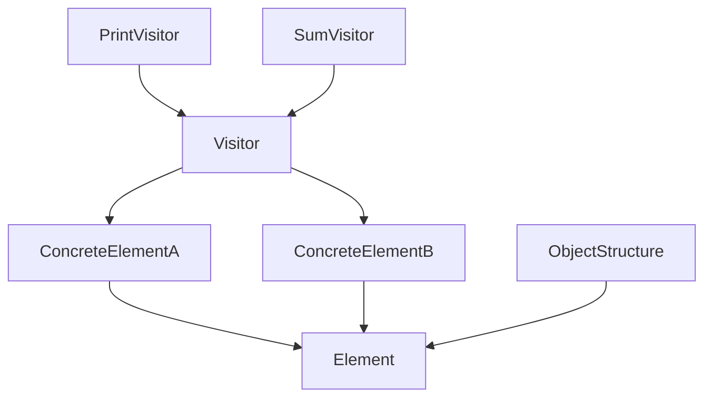

# 访问者模式（Visitor）

## 1. UML 简图


---

## 2. 模式概述

- **分类**：行为型模式
- **意图**：表示一个作用于某对象结构中的各元素的操作，使你可以在不改变各元素类的前提下定义作用于这些元素的新操作。
- **核心问题**：当对象结构稳定（元素类型较少且不常变化），但需要对其施加多种不同操作时，如何在不频繁修改元素类的情况下扩展新操作。

---

## 3. 实现要点

- **实现要点**：
  - 1）在元素接口中统一定义 `Accept(Visitor&)`，每个具体元素在其中调用 `visitor.Visit(*this)` 实现双重分派；
  - 2）在访问者接口中为每种元素类型声明一个 `VisitXxx()` 重载，并在具体访问者中实现不同的操作逻辑（如打印、求和等）；
  - 3）在对象结构中维护元素集合，对传入的访问者依次调用各元素的 `Accept()`，从而在不修改元素类的前提下，通过新增访问者类持续扩展新操作。

---

## 4. 结构与角色

- **Element（元素接口）**：
  - 声明 `Accept(Visitor&)` 接口；

- **ConcreteElement（具体元素）**：
  - 实现 `Accept()`，在其中调用 `visitor.Visit(*this)`；

- **Visitor（访问者接口）**：
  - 声明对不同元素类型的访问操作，如 `Visit(ElementA&)`、`Visit(ElementB&)`；

- **ConcreteVisitor（具体访问者）**：
  - 实现针对不同元素的具体操作逻辑；

- **ObjectStructure（对象结构）**：
  - 保存元素集合；
  - 提供方法让访问者遍历整个结构，对每个元素调用 `Accept()`。

---

## 5. 本目录代码结构说明

- `Visitor.h`：
  - 定义元素接口 `Element` 和两种具体元素 `ConcreteElementA/B`；
  - 定义访问者接口 `Visitor` 及两个具体访问者：
    - `PrintVisitor`：打印元素信息；
    - `SumVisitor`：对元素内部的数值进行求和；
  - `ObjectStructure` 保存一组元素，并提供 `Accept(Visitor&)`；
  - 提供演示函数：
    - `RunVisitorDemo()`。
- `main.cpp`：
  - 只负责调用演示函数。

---

## 6. 多种用法与设计思想

- 对同一组元素，可以编写多个访问者来实现不同的操作：
  - 如统计、打印、导出、校验等；
- 当需要新增一种操作时，只需新增一个访问者类，不必修改元素类；
- 当需要新增一种元素类型时，则需要为所有访问者添加对应的 `Visit()`，这也是访问者模式的使用权衡。

---

## 7. 典型适用场景

- 编译器中的 AST（抽象语法树）遍历与多种处理（打印、语义分析、优化、代码生成等）；
- 报表系统，对同一对象结构生成不同报表视图；
- 复杂对象结构上的多种统计、导出逻辑等。

---

## 8. 如何运行本示例

```bash
cd DesignPatterns/behavioral/visitor

# 使用 g++ 手动编译
g++ -std=c++17 -O2 -Wall -Wextra main.cpp -o visitor_example
./visitor_example

# 或在工程根目录使用 CMake 统一构建，然后运行
#   build/visitor_example
```

## 9. 运行结果示例

```
--- Visitor Demo ---
ConcreteElementA with value = 10
ConcreteElementB with value = 20
ConcreteElementA with value = 5
Sum of all element values = 35
```

## 10. 测试用例

本访问者模式包含以下测试用例：

- `test_visitor.cpp`：测试元素和访问者
- 验证访问者对不同元素的处理
- 测试双重分派机制
- 验证对象结构的遍历

运行测试：
```bash
# 在项目根目录运行
./scripts/run_tests.sh
# 或运行特定测试
./build/visitor_test
```
