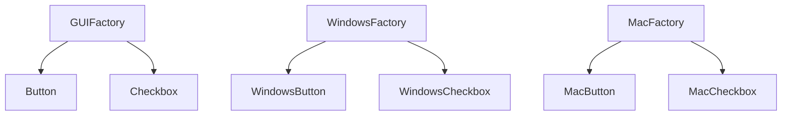

# 抽象工厂模式（Abstract Factory）

## 1. UML 简图


---

## 2. 模式概述

- **分类**：创建型模式
- **意图**：提供一个创建一系列相关或相互依赖对象的接口，而无需指定它们的具体类。
- **核心问题**：当系统需要“成套更换”一组对象（如 UI 控件、数据库访问组件等）时，如何在不修改客户端代码的前提下，切换到另一套实现。

抽象工厂强调的是“**产品族**”的概念：同一个产品族中的对象需要一起工作，它们之间存在天然的协作关系。

---

## 3. 实现要点

- **实现要点**：
  - 1）先按产品种类抽象出多个产品接口（如 `Button`、`Checkbox`），再定义抽象工厂接口 `GUIFactory`，在其中声明创建整套产品族的方法；
  - 2）为每个具体产品族（如 Windows / Mac）实现一个具体工厂类，内部返回对应平台风格的具体产品实现；
  - 3）客户端只依赖 `GUIFactory` 和抽象产品接口，通过替换具体工厂实例，即可整体切换一整套产品族而无需修改使用代码。

---

## 4. 角色与结构

- **抽象产品（Abstract Product）**：
  - 本示例中的 `Button`、`Checkbox`；
  - 定义产品族内不同产品种类的公共接口。

- **具体产品（Concrete Product）**：
  - `WindowsButton`、`WindowsCheckbox`、`MacButton`、`MacCheckbox`；
  - 实现具体平台/风格下的产品行为。

- **抽象工厂（Abstract Factory）**：
  - 本示例中的 `GUIFactory`；
  - 声明创建一族产品的接口：`CreateButton()`、`CreateCheckbox()`。

- **具体工厂（Concrete Factory）**：
  - `WindowsFactory`、`MacFactory`；
  - 决定创建哪个具体产品族（Windows 风格或 Mac 风格）。

客户端只依赖 **抽象工厂 + 抽象产品**，通过替换具体工厂对象即可整体切换产品族。

---

## 5. 本目录代码结构说明

- `AbstractFactory.h`：
  - 定义 `Button`、`Checkbox` 抽象产品及其各自的具体实现；
  - 定义 `GUIFactory` 抽象工厂及 `WindowsFactory`、`MacFactory`；
  - 提供演示函数：
    - `RenderUI(const GUIFactory&)`：通过抽象工厂创建一整套 UI，并调用其绘制方法；
    - `RunAbstractFactoryDemo()`：演示如何在客户端中切换不同工厂。
- `main.cpp`：
  - 只负责调用 `RunAbstractFactoryDemo()`。

---

## 6. 设计思想与适用场景

### 6.1 与工厂方法的区别

- **工厂方法**：
  - 通常关注“某一类产品”的创建（比如“日志记录器”）；
  - 重点在于让子类决定创建哪一种具体产品。

- **抽象工厂**：
  - 通常关注“一族相关产品”的创建（比如“按钮 + 复选框 + 文本框”这一套 UI 控件）；
  - 重点在于通过不同工厂，成体系地切换产品族。

### 6.2 典型适用场景

- 跨平台 UI 框架：
  - 不同操作系统下有不同的控件实现，但希望客户端代码对平台无感；
- 主题/皮肤系统：
  - 黑暗主题 / 明亮主题对应不同风格的控件；
- 多数据库支持：
  - 一套工厂负责创建各类数据库访问对象（连接、命令、事务等）。

---

## 7. 示例要点

本示例通过 `RunAbstractFactoryDemo()` 展示：

- 当使用 `WindowsFactory` 时，`RenderUI` 内部创建并绘制的是 Windows 风格的按钮和复选框；
- 当使用 `MacFactory` 时，所有控件自动切换为 Mac 风格；
- 客户端代码只需要替换工厂实例，而不需要修改 UI 绘制逻辑。

这体现了“**面向接口编程 + 依赖注入**”的思想：

- 上层模块依赖抽象工厂与抽象产品；
- 具体工厂的选择可以在运行时注入（如读取配置文件或命令行参数）。

---

## 8. 如何运行本示例

```bash
cd DesignPatterns/creational/abstract_factory

# 使用 g++ 手动编译
g++ -std=c++17 -O2 -Wall -Wextra main.cpp -o abstract_factory_example
./abstract_factory_example

# 或在工程根目录使用 CMake 统一构建，然后运行
#   build/abstract_factory_example
```

## 9. 运行结果示例

```
Use WindowsFactory:
Render Windows Button
Render Windows Checkbox

Use MacFactory:
Render Mac Button
Render Mac Checkbox
```

## 10. 测试用例

本抽象工厂模式包含以下测试用例：

- `test_abstract_factory.cpp`：测试不同工厂创建的产品族
- 验证产品族的一致性
- 测试工厂切换的正确性
- 验证多态行为正确性

运行测试：
```bash
# 在项目根目录运行
./scripts/run_tests.sh
# 或运行特定测试
./build/abstract_factory_test
```
