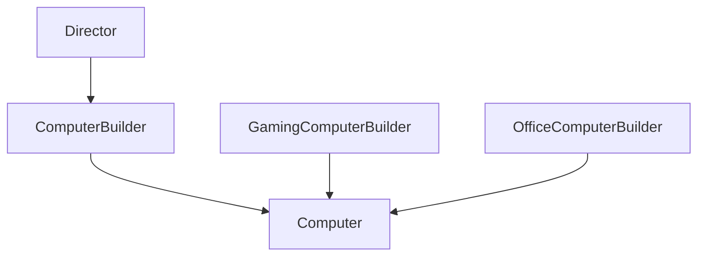

# 建造者模式（Builder）

## 1. UML 简图


---

## 2. 模式概述

- **分类**：创建型模式
- **意图**：将一个复杂对象的构建过程与它的表示分离，使同样的构建过程可以创建不同的表示。
- **核心问题**：当对象构建步骤相对稳定，但具体“如何构建每一步”会因配置不同而变化时，如何在不修改构建流程的前提下，得到不同配置的产品。

典型场景包括：组装不同配置的电脑、构建不同风格的文档、配置复杂的网络请求/报表等。

---

## 3. 实现要点

- **实现要点**：
  - 1）将“产品”与“构建过程”解耦：在抽象建造者 `ComputerBuilder` 中只声明构建各部件的方法和 `GetResult()` 接口；
  - 2）在具体建造者中维护产品对象，并在各个构建步骤中填充不同配置；
  - 3）由 `Director` 统一封装构建顺序（如先 CPU、再 GPU、再内存/存储），客户端只需选择不同建造者即可复用同一套构建流程得到不同配置的产品。

---

## 4. 角色与结构

- **Product（产品）**：
  - 本示例中的 `Computer`，包含 `cpu`、`gpu`、`ram`、`storage` 等属性；
  - 对外提供 `Show()` 方法展示配置。

- **Builder（抽象建造者）**：
  - 本示例中的 `ComputerBuilder`；
  - 声明构建各部分的抽象接口：`BuildCPU()`、`BuildGPU()`、`BuildRAM()`、`BuildStorage()`；
  - 声明 `GetResult()` 返回最终产品。

- **ConcreteBuilder（具体建造者）**：
  - `GamingComputerBuilder`：游戏电脑配置（高端 CPU / GPU、大内存、大容量 SSD）；
  - `OfficeComputerBuilder`：办公电脑配置（中端 CPU、集显、中等内存、中等存储）。

- **Director（指挥者）**：
  - 封装构建流程；
  - 负责按既定顺序调用建造者接口，例如：先构建 CPU，再 GPU，再内存，最后存储；
  - 不关心具体建造者的实现细节。

---

## 5. 本目录代码结构说明

- `Builder.h`：
  - 定义 `Computer`、`ComputerBuilder`、`GamingComputerBuilder`、`OfficeComputerBuilder`、`Director`；
  - 提供演示函数 `RunBuilderDemo()`，展示如何用同样的构建步骤创建两种不同配置的电脑。
- `main.cpp`：
  - 只负责调用 `RunBuilderDemo()`。

---

## 6. 设计思想与适用场景

### 6.1 与工厂方法的区别

- **工厂方法** 更关注“创建哪种产品”，一个工厂方法通常创建一个特定产品实例；
- **建造者模式** 更关注“产品由哪些部分构成 + 构建步骤”，强调过程控制和分步构造。

### 6.2 常见适用场景

- 对象的创建步骤比较复杂且有顺序要求；
- 同一套构建流程，最终需要产生不同配置或不同“表示”的产品；
- 希望将“如何一步步构建”从“构建流程本身”中抽离出来，构建流程相对稳定，配置经常变化。

---

## 7. 示例要点

在 `RunBuilderDemo()` 中：

- 使用同一个 `Director::Construct()` 构建电脑；
- 传入不同的建造者：
  - 传入 `GamingComputerBuilder` 时，得到高端游戏配置；
  - 传入 `OfficeComputerBuilder` 时，得到普通办公配置；
- 客户端代码只需要更换建造者，而不需要调整构建流程。

这体现了**开闭原则**：

- 增加新配置时，只需要新增一个具体建造者类，不需要修改 `Director` 与已有代码。

---

## 8. 如何运行本示例

```bash
cd DesignPatterns/creational/builder

# 使用 g++ 手动编译
g++ -std=c++17 -O2 -Wall -Wextra main.cpp -o builder_example
./builder_example

# 或在工程根目录使用 CMake 统一构建，然后运行
#   build/builder_example
```

## 9. 运行结果示例

```
Gaming PC:
CPU: High-end CPU
GPU: High-end GPU
RAM: 32GB
Storage: 1TB SSD

Office PC:
CPU: Mid-range CPU
GPU: Integrated GPU
RAM: 16GB
Storage: 512GB SSD
```

## 10. 测试用例

本建造者模式包含以下测试用例：

- `test_builder.cpp`：测试不同建造者创建的产品
- 验证构建过程的正确性
- 测试产品配置的准确性
- 验证指挥者与建造者的协作

运行测试：
```bash
# 在项目根目录运行
./scripts/run_tests.sh
# 或运行特定测试
./build/builder_test
```
