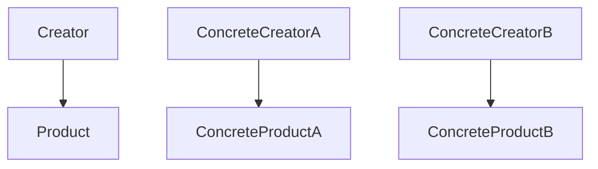

# 工厂方法模式（Factory Method）

## 1. UML 简图


---

## 2. 模式概述

- **分类**：创建型模式
- **意图**：定义一个用于创建对象的接口，让子类决定实例化哪一个具体类。
- **核心问题**：当“创建哪种产品”的逻辑会随着需求变化而变化时，如何在不修改现有客户端代码的前提下，引入新的产品类型。

工厂方法通过“**抽象工厂类 + 工厂方法 + 多态**”把产品创建延迟到子类，让“新增产品”只需要新增具体工厂类即可。

---

## 3. 实现要点

- **实现要点**：
  - 1）先抽象出产品接口（`Product`）和工厂基类（`Creator`），在工厂基类中声明纯虚的工厂方法 `CreateProduct()`；
  - 2）为每种具体产品实现对应的 `ConcreteProductX` 类，并提供一个对应的 `ConcreteCreatorX` 子类，在其中重写 `CreateProduct()` 返回指定产品类型；
  - 3）在客户端持有 `Creator*` 或智能指针，通过多态来创建和使用具体产品，实现“新增产品只增加类、不修改调用代码”的效果。

---

## 4. 角色与结构

- **Product（抽象产品）**：定义产品对外的统一接口，例如 `Use()`。
- **ConcreteProductA / ConcreteProductB（具体产品）**：实现抽象产品接口，封装不同的业务行为。
- **Creator（抽象工厂）**：
  - 声明工厂方法 `CreateProduct()`；
  - 可以包含依赖抽象产品的通用业务逻辑，例如示例中的 `AnOperation()`。
- **ConcreteCreatorA / ConcreteCreatorB（具体工厂）**：
  - 实现工厂方法，决定实例化哪种具体产品；
  - 当新增产品类型时，通常新增一个对应的具体工厂类。

---

## 5. 本目录代码结构说明

- `FactoryMethod.h`：
  - 定义了上述所有角色：`Product`、`ConcreteProductA/B`、`Creator`、`ConcreteCreatorA/B`；
  - 提供演示函数 `RunFactoryMethodDemo()`，展示如何通过不同工厂创建不同产品；
  - **新增工厂注册表模式**：`ProductRegistry` 使用 lambda 和 std::function 实现灵活的产品注册；
  - **线程安全支持**：注册表使用 std::mutex 保护并发访问；
  - **演示函数**：
    - `RunFactoryMethodDemo()`：传统工厂方法示例
    - `RunRegistryDemo()`：工厂注册表模式示例
- `main.cpp`：
  - 只负责调用演示函数；
  - 与具体产品类型和工厂实现解耦。

所有 C++ 代码均带有详细中文注释，说明每个类在结构中的角色和职责。

---

## 6. 线程安全与性能优化

### 6.1 线程安全问题分析

工厂方法模式本身通常是无状态的，但在以下场景需要考虑线程安全：

1. **工厂注册表的并发访问**
   - 多个线程同时注册或查询工厂
   - 需要使用互斥锁保护注册表

2. **对象池的并发控制**
   - 如果工厂内部使用对象池复用产品
   - 需要同步对象的获取和归还

3. **单例工厂的线程安全**
   - 如果工厂本身是单例
   - 参考单例模式的线程安全实现

### 6.2 工厂注册表模式（推荐）

**优点**：
- 使用 `std::function` 和 lambda，避免为每个产品创建工厂类
- 减少类层次，提高代码灵活性
- 支持动态注册，便于插件化架构
- 使用 `std::mutex` 保证线程安全

**实现要点**：
```cpp
class ProductRegistry {
public:
    using FactoryFunction = std::function<std::unique_ptr<Product>()>;
    
    // 线程安全的注册
    static void Register(const std::string& type, FactoryFunction factory) {
        std::lock_guard<std::mutex> lock(mutex_);
        registry_[type] = std::move(factory);
    }
    
    // 线程安全的创建
    static std::unique_ptr<Product> Create(const std::string& type) {
        std::lock_guard<std::mutex> lock(mutex_);
        auto it = registry_.find(type);
        return (it != registry_.end()) ? it->second() : nullptr;
    }
};
```

### 6.3 性能优化建议

1. **对象池复用**
   - 对于创建成本高的对象，使用对象池
   - 减少频繁的内存分配和释放

2. **工厂单例化**
   - 如果工厂无状态，可以复用工厂实例
   - 使用 Meyers Singleton 保证线程安全

3. **读写锁优化**
   - 注册表如果读多写少，使用 `std::shared_mutex`
   - 读操作使用 `shared_lock`，写操作使用 `unique_lock`

4. **减少锁粒度**
   - 先在锁外准备数据，最后才加锁插入注册表
   - 避免在持有锁时执行耗时操作

### 6.4 C++ 标准版本特性

#### C++11
- ✅ `std::unique_ptr`、`std::make_unique`（C++14）
- ✅ `std::function`、lambda 表达式
- ✅ `std::mutex`、`std::lock_guard`
- ✅ 移动语义优化对象传递

#### C++14
- ✅ `std::make_unique` 标准化
- ✅ 泛型 lambda（auto 参数）

#### C++17
- ✅ `inline static` 简化静态成员定义
- ✅ `std::optional` 用于可选产品
- ✅ 结构化绑定简化代码

#### C++20
- ✅ **Concepts** 约束工厂接口
  ```cpp
  template<typename T>
  concept ProductFactory = requires(T t) {
      { t.CreateProduct() } -> std::convertible_to<std::unique_ptr<Product>>;
  };
  ```
- ✅ 模块系统优化编译速度

#### C++23
- ✅ `std::expected` 用于错误处理
- ✅ 模式匹配优化产品选择逻辑

---

## 7. 设计思想与适用场景

### 7.1 与简单工厂的对比

- **简单工厂**：
  - 通常是一个 `switch` / `if-else` 集中判断要创建的产品类型；
  - 当新增产品时，需要修改工厂内部代码，不符合开闭原则；
  - 适合产品类型较少、变化不频繁的简单场景。

- **工厂方法**：
  - 使用“子类多态”替代 `switch` 逻辑；
  - 新增产品时，只需新增一个具体产品类和对应的具体工厂类；
  - 抽象工厂类保持稳定，更符合“对扩展开放，对修改关闭”。

### 7.2 典型适用场景

- 框架或库需要让使用者通过继承自定义产品创建逻辑；
- 系统中存在稳定的“产品接口”，但具体产品类型经常变化；
- 希望把“如何创建产品”的决策延迟到运行时（例如根据配置选择不同工厂）。

---

## 8. 示例要点

示例中：

- `Creator::AnOperation()` 是一个非常典型的写法：
  - 在基类中依赖抽象产品接口；
  - 通过调用工厂方法 `CreateProduct()` 获取产品实例；
  - 从而实现“业务逻辑 + 对象创建”的分离。

- 客户端代码只依赖 `Creator*` 指针或智能指针：
  - 通过 `new ConcreteCreatorA` 或 `new ConcreteCreatorB` 决定最终得到哪种产品；
  - 主流程不需要因为产品增加/减少而修改。

---

## 9. 如何运行本示例

```bash
cd DesignPatterns/creational/factory_method

# 使用 g++ 手动编译
g++ -std=c++17 -O2 -Wall -Wextra main.cpp -o factory_method_example
./factory_method_example

# 或在工程根目录使用 CMake 统一构建，然后运行
#   build/factory_method_example
```

## 10. 运行结果示例

```
FactoryMethod: use creatorA
Use ConcreteProductA
FactoryMethod: use creatorB
Use ConcreteProductB
```

## 11. 测试用例

本工厂方法模式包含以下测试用例：

- `test_factory_method.cpp`：测试传统工厂方法和工厂注册表模式
- 验证不同工厂能够正确创建相应的产品
- 测试线程安全的工厂注册表
- 验证多态行为正确性

运行测试：
```bash
# 在项目根目录运行
./scripts/run_tests.sh
# 或运行特定测试
./build/factory_method_test
```
