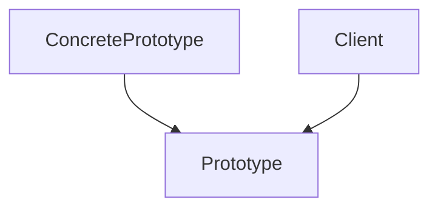

# 原型模式（Prototype）

## 1. UML 简图


---

## 2. 模式概述

- **分类**：创建型模式
- **意图**：用原型实例指定创建对象的种类，并且通过拷贝这些原型创建新的对象。
- **核心问题**：当对象的创建成本较高、结构复杂或运行时才知道需要创建哪种对象时，如何快速高效地创建“相似但不完全相同”的对象。

当创建对象的成本较高（如深层对象图、代价昂贵的初始化）且经常需要“大致相同但略有差异”的对象时，原型模式很有用。

---

## 3. 实现要点

- **实现要点**：
  - 1）为抽象原型类声明虚函数 `Clone()`，返回指向自身副本的指针或智能指针；
  - 2）在具体原型类中实现 `Clone()`，根据需要执行浅拷贝或深拷贝（本示例中演示深拷贝），保证复制后的对象状态独立；
  - 3）客户端通过已存在的原型实例调用 `Clone()` 获取新对象，可以在克隆后按需微调部分字段，避免在多处重复编写复杂的构造/初始化逻辑。

---

## 4. 角色与结构

- **Prototype（抽象原型）**：
  - 声明克隆接口 `Clone()`，返回一个拷贝自身的新对象；
  - 声明展示或业务接口，如 `Show()`。

- **ConcretePrototype（具体原型）**：
  - 实现 `Clone()`，决定是浅拷贝还是深拷贝；
  - 保存需要被复制的内部状态，并在 `Show()` 中输出。

客户端通过持有 `Prototype*` / 智能指针来操作对象，而无需关心具体原型类型和拷贝细节。

---

## 5. 本目录代码结构说明

- `Prototype.h`：
  - 定义抽象原型 `Prototype`：声明 `Clone()` 和 `Show()`；
  - 定义具体原型 `ConcretePrototype`：在 `Clone()` 中执行深拷贝；
  - 提供演示函数 `RunPrototypeDemo()`：创建一个原型对象，调用 `Clone()` 复制并输出结果。
- `main.cpp`：
  - 只负责调用 `RunPrototypeDemo()`。

---

## 6. 设计思想与适用场景

### 6.1 与 `new` 直接创建的对比

- 直接使用 `new`：
  - 需要在多处写重复的初始化逻辑；
  - 当对象内部结构或初始化参数发生变化时，所有创建代码都可能需要同步修改。

- 使用原型模式：
  - 将“如何初始化一个标准对象”的逻辑集中在原型对象中；
  - 客户端通过 `Clone()` 复制原型，再在必要时做少量修改（例如更新其中一个字段）；
  - 更符合开闭原则，减少重复代码和出错点。

### 6.2 典型适用场景

- **复杂对象的复制**：
  - 对象包含多个指针成员、容器成员等，需要细致控制“深拷贝”与“浅拷贝”；
- **运行时决定对象类型**：
  - 如图形编辑器中，不同图元的复制/粘贴功能，可以通过原型克隆实现；
- **避免暴露构造细节**：
  - 某些对象的构造逻辑复杂且仅在内部可见，外部只能通过克隆方式获得新实例。

---

## 7. 示例要点

在 `RunPrototypeDemo()` 中：

- 首先创建一个原型对象 `ConcretePrototype("origin", 42)`；
- 然后通过 `Clone()` 得到一个新的实例，并调用 `Show()` 输出状态；
- 你可以自行扩展：在克隆后修改新对象的部分字段，以模拟“在原型基础上微调配置”的场景。

---

## 8. 如何运行本示例

```bash
cd DesignPatterns/creational/prototype

# 使用 g++ 手动编译
g++ -std=c++17 -O2 -Wall -Wextra main.cpp -o prototype_example
./prototype_example

# 或在工程根目录使用 CMake 统一构建，然后运行
#   build/prototype_example
```

## 9. 运行结果示例

```
ConcretePrototype{name=origin, value=42}
ConcretePrototype{name=origin, value=42}
```

## 10. 测试用例

本原型模式包含以下测试用例：

- `test_prototype.cpp`：测试原型克隆功能
- 验证深拷贝的正确性
- 测试克隆对象的独立性
- 验证多态克隆行为

运行测试：
```bash
# 在项目根目录运行
./scripts/run_tests.sh
# 或运行特定测试
./build/prototype_test
```
