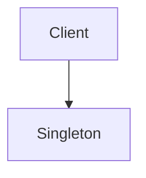

# 单例模式（Singleton）

## 1. UML 简图


---

## 2. 模式概述

- **分类**：创建型模式
- **意图**：确保一个类只有一个实例，并且提供一个全局访问点。
- **核心问题**：当系统中某些资源应当是“全局唯一”时，如何集中管理它们的创建和访问，并保证在多线程环境下的安全性。

典型应用场景包括：配置管理器、日志系统、数据库连接池、线程池、全局缓存等。

---

## 3. 实现要点

- **实现要点**：
  - 1）将构造函数和拷贝/赋值函数设为 `private` 或直接 `delete`，从语法层面禁止在类外构造和拷贝；
  - 2）在类内部保存一个静态实例（指针或局部静态对象），作为“唯一实例”的存放位置；
  - 3）通过 `Instance()` 等静态成员函数对外提供全局访问点，在该函数中根据需要实现懒加载（首次访问再创建）并使用互斥量或局部静态变量保证线程安全；
  - 4）根据不同场景选择懒汉/饿汉/Meyers 等实现，在“启动开销、访问频率、线程安全”之间做权衡。

---

## 4. 设计思想与常见变体

单例模式的本质是：**控制构造函数 + 控制实例个数 + 提供全局访问点**。

在 C++ 中常见的实现变体主要包括：

1. **懒汉式（延迟初始化）**
   - 第一次访问时才创建实例；
   - 优点：如果实例很重且不一定会用到，可以延迟开销；
   - 缺点：多线程下需要加锁或使用其他同步手段保证只创建一次。

2. **饿汉式（类加载时初始化）**
   - 程序启动（静态初始化）阶段就创建实例；
   - 优点：实现简单、线程天然安全；
   - 缺点：如果实例很大而实际不一定用到，会浪费资源。

3. **带互斥量的懒汉式（线程安全懒汉）**
   - 在获取实例时加锁，保证只创建一次；
   - 缺点：每次获取实例都要加锁，存在性能开销；
   - 可通过“双重检查锁定”优化，但需要特别注意内存模型与指令重排问题。

4. **Meyers Singleton（函数内局部静态变量）**
   - C++11 标准保证函数内局部静态变量的初始化是线程安全的；
   - 综合考虑简洁性和安全性，是现代 C++ 中推荐的单例写法之一。

---

## 5. 本目录代码结构说明

- `Singletons.h`：
  - `LazySingletonUnsafe`：懒汉式，不加锁（多线程下不安全）；
  - `LazySingletonMutex`：懒汉式 + `std::mutex` 互斥量，线程安全；
  - `LazySingletonDCL`：懒汉式 + 双重检查锁定（DCL），性能优化版本；
  - `LazySingletonCallOnce`：懒汉式 + `std::call_once`，简洁的线程安全实现；
  - `HungrySingleton`：饿汉式，静态对象在程序启动时构造；
  - `MeyersSingleton`：使用函数内局部静态变量的推荐写法（C++11+）；
  - `AtomicSingleton`：使用 `std::atomic<std::shared_ptr>` 的高性能实现（C++11+）。
- `main.cpp`：
  - 依次调用上述几种单例实现，打印日志并输出地址，用于直观对比“是否真的是同一实例”。

所有 C++ 代码均附带详细中文注释，解释每种实现的**优缺点、线程安全性和适用场景**。

---

## 6. 示例要点与对比

### 6.1 懒汉式（不加锁） vs 懒汉式（加锁）

- **不加锁版本**：
  - 只适用于单线程环境或可以保证实例在多线程之前就已构造好的场景；
  - 多线程并发调用 `Instance()` 时可能导致创建多个实例，破坏单例语义。

- **加锁版本**：
  - 使用 `std::mutex` 对创建过程加锁，确保只创建一次；
  - 每次获取实例都需要加锁，有一定性能开销；
  - 更适合“访问频率一般、但必须保证线程安全”的场景。

### 6.2 饿汉式 vs 懒汉式

- **饿汉式**：
  - 在程序启动时就创建实例，简单可靠；
  - 适合实例较轻、且几乎肯定会使用的场景；
  - 典型代码使用静态对象：`static HungrySingleton instance_;`。

- **懒汉式**：
  - 在第一次访问时才创建实例，可避免不必要的资源占用；
  - 适合实例较重、且不一定会被用到的场景；
  - 需要考虑多线程同步问题。

### 6.3 Meyers Singleton

- 使用函数内局部静态变量：

  ```cpp
  static MeyersSingleton& Instance() {
      static MeyersSingleton instance; // C++11 保证线程安全
      return instance;
  }
  ```

- 优点：
  - 代码简洁、可读性好；
  - 延迟初始化 + 线程安全；
  - 不需要手动管理指针和内存。

---

## 7. 适用场景与注意事项

- **适用场景**：
  - 确实存在全局唯一的资源或组件（配置、日志、设备管理器等）；
  - 全局访问更符合业务语义，而非仅仅为了“图省事”。

- **不适合的场景**：
  - 滥用单例会导致隐藏的全局状态，使系统难以测试和扩展；
  - 在高并发、高可测试性要求的系统中，应谨慎使用单例，或通过依赖注入替代。

- **线程安全注意点**:
  - C++11 之前的双重检查锁定实现容易踩内存模型坑,建议在现代 C++ 中使用 `std::call_once` 或局部静态变量；
  - 尽量避免使用裸指针管理生命周期,除非仅用于演示传统写法。

---

## 8. 线程安全与性能优化详解

### 8.1 线程安全问题分析

单例模式在多线程环境下的主要风险：
1. **竞态条件**：多个线程同时检查 `instance == nullptr` 可能导致创建多个实例
2. **指令重排**：编译器和CPU可能重排指令，导致未完全初始化的对象被使用
3. **内存可见性**：一个线程创建的实例可能对其他线程不可见

### 8.2 各种实现的性能对比

| 实现方式 | 线程安全 | 延迟初始化 | 性能 | 适用场景 |
|---------|---------|-----------|------|----------|
| LazySingletonUnsafe | ❌ | ✅ | ⭐⭐⭐⭐⭐ | 单线程环境 |
| LazySingletonMutex | ✅ | ✅ | ⭐⭐ | 低频访问 |
| LazySingletonDCL | ✅ | ✅ | ⭐⭐⭐⭐ | 高频访问，需要延迟初始化 |
| LazySingletonCallOnce | ✅ | ✅ | ⭐⭐⭐⭐ | 代码简洁性优先 |
| HungrySingleton | ✅ | ❌ | ⭐⭐⭐⭐⭐ | 确定会使用的全局对象 |
| MeyersSingleton | ✅ | ✅ | ⭐⭐⭐⭐⭐ | **最推荐** |
| AtomicSingleton | ✅ | ✅ | ⭐⭐⭐⭐⭐ | 高并发场景 |

### 8.3 关键技术点

#### 8.3.1 双重检查锁定（DCL）
```cpp
// 错误示例（C++11之前）- 存在指令重排问题
if (instance == nullptr) {
    lock();
    if (instance == nullptr) {
        instance = new Singleton(); // 可能重排
    }
    unlock();
}

// 正确示例（C++11+）- 使用 std::atomic
std::atomic<Singleton*> instance;
auto tmp = instance.load(std::memory_order_acquire);
if (tmp == nullptr) {
    lock();
    tmp = instance.load(std::memory_order_relaxed);
    if (tmp == nullptr) {
        tmp = new Singleton();
        instance.store(tmp, std::memory_order_release);
    }
    unlock();
}
```

#### 8.3.2 Memory Order 说明
- `memory_order_acquire`：读操作，保证之后的读写不会被重排到此之前
- `memory_order_release`：写操作，保证之前的读写不会被重排到此之后
- `memory_order_relaxed`：无同步约束，仅保证原子性

#### 8.3.3 智能指针优化
```cpp
// C++11: 使用 std::shared_ptr 自动管理生命周期
static std::atomic<std::shared_ptr<Singleton>> instance;

// C++20: std::atomic<std::shared_ptr> 特化提供更好的性能
// 内部使用了更高效的原子操作实现
```

### 8.4 性能优化建议

1. **优先选择 Meyers Singleton**
   - 代码最简洁
   - 编译器自动处理线程安全
   - 性能接近饿汉式

2. **高并发场景使用 AtomicSingleton**
   - 使用 `std::atomic` 减少锁竞争
   - 结合 DCL 模式优化

3. **避免频繁加锁**
   - 简单的 mutex 保护每次都加锁，性能较差
   - DCL 或 call_once 只在初始化时加锁

4. **考虑缓存行对齐**
   ```cpp
   // 避免伪共享（false sharing）
   alignas(64) static std::atomic<Singleton*> instance;
   ```

---

## 9. C++ 标准版本特性

### C++11
- ✅ **局部静态变量线程安全初始化**（magic static）
- ✅ `std::mutex`, `std::lock_guard`
- ✅ `std::atomic` 和 memory order
- ✅ `std::call_once`, `std::once_flag`
- ✅ `delete` 关键字禁止拷贝/赋值
- ✅ `std::make_shared`

### C++14
- ✅ `std::make_unique` 标准化
- ✅ 泛型 lambda 表达式

### C++17
- ✅ **inline 静态成员变量**（简化类外定义）
- ✅ `std::shared_mutex` 改进（读写锁）
- ✅ 结构化绑定

### C++20
- ✅ `std::atomic<std::shared_ptr<T>>` **特化**（性能提升）
- ✅ `constinit` 关键字（编译期初始化）
- ✅ 协程支持
- ✅ 模块系统

### C++23
- ✅ `std::atomic` 性能持续优化
- ✅ 更好的类型推导

### 不同版本的写法示例

```cpp
// C++11 版本
class SingletonCpp11 {
public:
    static SingletonCpp11& Instance() {
        static SingletonCpp11 instance;
        return instance;
    }
private:
    SingletonCpp11() = default;
};

// C++17 版本（inline static）
class SingletonCpp17 {
public:
    static SingletonCpp17& Instance() { return instance_; }
private:
    inline static SingletonCpp17 instance_;
};

// C++20 版本（使用 constinit）
class SingletonCpp20 {
public:
    static SingletonCpp20& Instance() { return instance_; }
private:
    constinit static SingletonCpp20 instance_;
};
constinit SingletonCpp20 SingletonCpp20::instance_;
```

---

## 10. 如何运行本示例

```bash
cd DesignPatterns/creational/singleton

# 使用 g++ 手动编译
g++ -std=c++17 -O2 -Wall -Wextra main.cpp -o singleton_example
./singleton_example

# 或在工程根目录使用 CMake 统一构建，然后运行
#   build/singleton_example
```

## 11. 运行结果示例

```
HungrySingleton constructed
LazySingletonUnsafe constructed
[LazyUnsafe] 第一次调用 LazySingletonUnsafe
[LazyUnsafe] 第二次调用 LazySingletonUnsafe（同一实例）
LazySingletonUnsafe address: 0x151605eb0 , 0x151605eb0

LazySingletonMutex constructed
[LazyMutex] 第一次调用 LazySingletonMutex
[LazyMutex] 第二次调用 LazySingletonMutex（同一实例）
LazySingletonMutex address: 0x151606000 , 0x151606000

[Hungry] 第一次调用 HungrySingleton
[Hungry] 第二次调用 HungrySingleton（同一实例）
HungrySingleton address: 0x1029fc090 , 0x1029fc090

MeyersSingleton constructed
[Meyers] 第一次调用 MeyersSingleton
[Meyers] 第二次调用 MeyersSingleton（同一实例）
MeyersSingleton address: 0x1029fc1c0 , 0x1029fc1c0
```

## 12. 测试用例

本单例模式包含以下测试用例：

- `test_singleton.cpp`：测试7种不同的单例实现
- 验证每个单例模式确实只创建一个实例
- 测试线程安全性
- 验证不同实现方式的性能差异

运行测试：
```bash
# 在项目根目录运行
./scripts/run_tests.sh
# 或运行特定测试
./build/singleton_test
```
