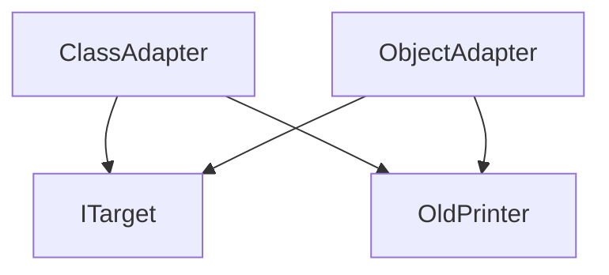

# 适配器模式（Adapter）

## 1. UML 简图


---

## 2. 模式概述

- **分类**：结构型模式
- **意图**：将一个类的接口转换成客户端期望的另一种接口，使得原本由于接口不兼容而不能一起工作的类可以协同工作。
- **核心问题**：当已有类功能满足需求，但接口形式与现有系统不匹配时，如何在 **不改动已有类** 的前提下进行复用。

常见场景：老接口迁移、新旧系统对接、第三方库适配等。

---

## 3. 实现要点

- **实现要点**：
  - 1）先抽象出客户端期望的目标接口 `ITarget`，统一对外暴露的调用形式；
  - 2）保留原有的被适配者类 `OldPrinter` 不做修改，适配器内部要么通过多继承“继承 + 实现”获得其能力（类适配器），要么以成员形式持有 `OldPrinter` 对象（对象适配器）；
  - 3）在适配器的 `Print()` 等实现中，将 `std::string` 等参数转换为旧接口所需形式，并转发调用 `OldPrint()`，从而在不改动旧类的前提下，让其适配到新接口体系中。

---

## 4. 结构与角色

以“打印接口适配”为例：

- **Target（目标接口）**：客户端期望使用的接口，例如 `Print(const std::string&)`；
- **Adaptee（被适配者）**：已有类，接口不兼容，例如只提供 `OldPrint(const char*)`；
- **Adapter（适配器）**：实现 `Target` 接口，但内部把调用转换为对 `Adaptee` 的调用。

在 C++ 中常见两种适配方式：

1. **类适配器（基于继承）**
   - 适配器继承自 `Adaptee`（以及实现/继承 `Target` 接口）；
   - 在适配器中重写 `Target` 的方法，将其转发给 `Adaptee` 的方法；
   - 受限于 C++ 单继承/多继承的设计，类适配器在实际工程中使用较少，但有利于重用和覆盖 `Adaptee` 行为。

2. **对象适配器（基于组合）**
   - 适配器持有一个 `Adaptee` 对象（指针或引用）；
   - 在 `Target` 方法内部调用持有的 `Adaptee` 实例；
   - 更灵活，可以在运行时替换内部的 `Adaptee` 对象，是工程中更常见的做法。

---

## 5. 本目录代码结构说明

- `Adapter.h`
  - 定义：
    - `ITarget`：目标接口，客户端统一依赖该接口；
    - `OldPrinter`：被适配者，只提供旧接口 `OldPrint(const char*)`；
    - `ClassAdapter`：类适配器，继承自 `OldPrinter` 并实现 `ITarget`；
    - `ObjectAdapter`：对象适配器，内部组合一个 `OldPrinter`；
  - 提供演示函数：
    - `RunClassAdapterDemo()`：演示类适配器用法；
    - `RunObjectAdapterDemo()`：演示对象适配器用法；
    - `RunAdapterDemo()`：统一调用上述两个函数。
- `main.cpp`
  - 只负责包含 `Adapter.h` 并在 `main()` 中调用 `RunAdapterDemo()`。

所有 C++ 代码均带详细中文注释，解释每种适配方式的实现细节与优缺点，方便对比学习。

---

## 6. 设计思想与多种用法

### 6.1 类适配器（ClassAdapter）

- **实现方式**：
  - `class ClassAdapter : public ITarget, public OldPrinter`；
  - `Print()` 内部直接调用继承自 `OldPrinter` 的 `OldPrint()`；
- **优点**：
  - 可以直接访问 `OldPrinter` 的受保护成员，适合在适配过程中对内部行为做“细粒度重用”；
- **缺点**：
  - 继承结构固定，无法在运行时替换被适配对象；
  - 当被适配者很多时，不利于组合使用。

### 6.2 对象适配器（ObjectAdapter）

- **实现方式**：
  - `class ObjectAdapter : public ITarget { OldPrinter printer_; }`；
  - `Print()` 内部调用 `printer_.OldPrint()`；
- **优点**：
  - 基于组合，灵活，可以在运行时替换内部 `OldPrinter`；
  - 更符合“优先使用组合而非继承”的原则；
- **缺点**：
  - 无法直接访问 `OldPrinter` 的受保护成员（通常不是问题）。

在本示例中，我们同时展示这两种方式，方便你根据实际工程需求选择合适的实现。

---

## 7. 典型适用场景

- 引入第三方库，但其接口风格与现有代码不匹配；
- 替换旧模块时，为了保证旧客户端不改动，需要通过适配器将新接口包装成旧接口；
- 统一多种差异较小的接口，将不同厂商/协议的实现统一到同一套 `Target` 接口上。

---

## 8. 如何运行本示例

```bash
cd DesignPatterns/structural/adapter

# 使用 g++ 手动编译
g++ -std=c++17 -O2 -Wall -Wextra main.cpp -o adapter_example
./adapter_example

# 或在工程根目录使用 CMake 统一构建，然后运行
#   build/adapter_example
```

## 9. 运行结果示例

```
--- ClassAdapter Demo ---
[OldPrinter] Hello from ClassAdapter

--- ObjectAdapter Demo ---
[OldPrinter] Hello from ObjectAdapter
```

## 10. 测试用例

本适配器模式包含以下测试用例：

- `test_adapter.cpp`：测试类适配器和对象适配器
- 验证接口转换的正确性
- 测试适配器的转发功能
- 验证多态行为正确性

运行测试：
```bash
# 在项目根目录运行
./scripts/run_tests.sh
# 或运行特定测试
./build/adapter_test
```
