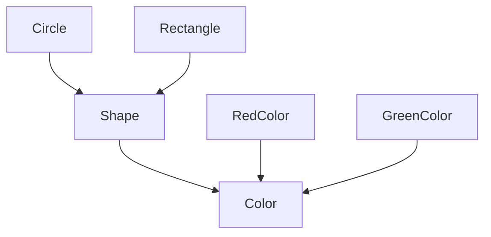

# 桥接模式（Bridge）

## 1. UML 简图


---

## 2. 模式概述

- **分类**：结构型模式
- **意图**：将抽象部分与它的实现部分分离，使它们可以独立变化。
- **核心问题**：当一个类存在多个变化维度（例如“形状 × 颜色”、“设备 × 通讯方式”等）时，如何避免因为组合爆炸而产生大量子类。

桥接模式通过“**抽象类持有实现接口指针**”的方式，把原本可能写成继承关系的两条变化轴拆开，用组合进行“桥接”。

---

## 3. 实现要点

- **实现要点**：
  - 1）将颜色维度抽象为独立接口 `Color`，并为不同颜色实现各自的具体类；
  - 2）在抽象图形类 `Shape` 中持有一个 `std::shared_ptr<Color>` 成员，通过组合而不是继承把“颜色实现”桥接进来；
  - 3）具体图形（如 `Circle`、`Rectangle`）在 `Draw()` 中只关心几何信息，再委托给 `color_->ApplyColor()` 完成着色，从而实现“形状层次”和“颜色层次”各自独立扩展、按需组合。

---

## 4. 结构与角色

以“图形着色”为例：

- **Implementor（实现接口）**：
  - 示例中的 `Color` 接口，表示“给图形上色”的能力；
  - 定义 `ApplyColor()` 等操作。

- **ConcreteImplementor（具体实现）**：
  - 示例中的 `RedColor`、`GreenColor` 等；
  - 提供不同的上色逻辑或输出效果。

- **Abstraction（抽象部分）**：
  - 示例中的 `Shape` 抽象类，代表几何图形；
  - 内部持有一个 `std::shared_ptr<Color>` 指针，用来“桥接”到颜色实现。

- **RefinedAbstraction（扩展抽象）**：
  - 示例中的 `Circle`、`Rectangle` 等具体图形；
  - 在 `Draw()` 中调用 `color_->ApplyColor()` 来完成着色。

这样，“图形种类” 与 “颜色种类” 就可以分别扩展，而不会产生 `RedCircle`、`GreenCircle`、`RedRectangle`、`GreenRectangle` 这种组合爆炸的类层次。

---

## 5. 本目录代码结构说明

- `Bridge.h`：
  - 定义 `Color` 接口及多个具体颜色实现；
  - 定义 `Shape` 抽象类和 `Circle`、`Rectangle` 两种具体图形；
  - 提供两个演示函数：
    - `RunBasicBridgeDemo()`：展示不同形状 × 颜色的组合；
    - `RunDynamicBridgeDemo()`：演示在运行时切换颜色实现。
- `main.cpp`：
  - 只负责调用 `RunBasicBridgeDemo()` 与 `RunDynamicBridgeDemo()`。

---

## 6. 多种用法与设计思想

### 6.1 基础用法：多维度组合

在 `RunBasicBridgeDemo()` 中：

- 创建 `RedColor`、`GreenColor` 等颜色实现；
- 创建 `Circle`、`Rectangle` 这类图形，并为每个图形注入不同的颜色实现；
- 调用 `Draw()` 时，由图形负责几何信息输出，由颜色负责颜色信息输出。

### 6.2 运行时切换实现

在 `RunDynamicBridgeDemo()` 中：

- 创建一个 `Circle`，初始绑定 `RedColor`；
- 在运行过程中，将其内部的 `Color` 指针切换为 `GreenColor`；
- 再次调用 `Draw()`，可以看到相同图形在不同颜色实现下的不同表现。

这种“运行时切换实现”的能力，是继承方式难以优雅实现的：如果用继承，往往需要重新创建一个新的子类实例，而桥接模式只需更换内部的实现指针即可。

---

## 7. 典型适用场景

- GUI 库中，将“控件抽象”与“平台相关绘制实现”分离；
- 图形渲染中，将“对象抽象”与“渲染后端（OpenGL/DirectX/Vulkan 等）”分离；
- 网络库中，将“高层协议”与“底层传输实现（TCP/UDP、不同 OS 套接字）”分离。

---

## 8. 如何运行本示例

```bash
cd DesignPatterns/structural/bridge

# 使用 g++ 手动编译
g++ -std=c++17 -O2 -Wall -Wextra main.cpp -o bridge_example
./bridge_example

# 或在工程根目录使用 CMake 统一构建，然后运行
#   build/bridge_example
```

## 9. 运行结果示例

```
--- Basic Bridge Demo ---
Draw a circle with radius 5 and color red
Draw a rectangle 3x4 with color green

--- Dynamic Bridge Demo ---
Draw a circle with radius 10 and color red
Draw a circle with radius 10 and color green
```

## 10. 测试用例

本桥接模式包含以下测试用例：

- `test_bridge.cpp`：测试基本桥接和动态切换
- 验证抽象与实现的正确组合
- 测试运行时切换实现的功能
- 验证多态行为正确性

运行测试：
```bash
# 在项目根目录运行
./scripts/run_tests.sh
# 或运行特定测试
./build/bridge_test
```
