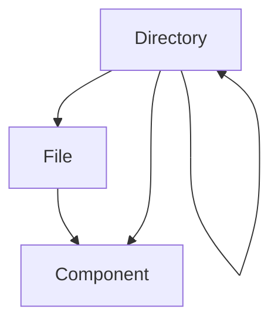

# 组合模式（Composite）

## 1. UML 简图


---

## 2. 模式概述

- **分类**：结构型模式
- **意图**：将对象组合成树形结构以表示“部分-整体”的层次结构，使得客户端可以统一对待单个对象和组合对象。
- **核心问题**：如何对待“单个对象”和“由多个对象组成的容器对象”——希望客户端不必关心它们是“叶子”还是“组合”，接口保持一致。

典型场景：文件系统目录树、组织机构树、GUI 组件树等。

---

## 3. 实现要点

- **实现要点**：
  - 1）抽象出统一的组件接口 `Component`，让叶子和组合节点都继承自它，并在其中声明诸如 `Operation()`、`GetSize()` 等通用操作；
  - 2）在叶子类 `File` 中直接实现这些操作，而在组合类 `Directory` 中维护一个子组件容器，并在自身操作中递归遍历和汇总子组件；
  - 3）客户端始终通过 `std::shared_ptr<Component>` 操作整棵树，而不需要区分当前拿到的是文件还是目录，实现对“部分”和“整体”的统一处理。

---

## 4. 结构与角色

以“文件系统”示例：

- **Component（抽象构件）**：
  - 声明统一接口，如 `Operation()`、`GetSize()` 等；
  - 可以为叶子和组合提供默认实现。

- **Leaf（叶子）**：
  - 示例中的 `File`，表示普通文件；
  - 实现 `Operation()` 输出自身信息，实现 `GetSize()` 返回文件大小。

- **Composite（组合）**：
  - 示例中的 `Directory`，表示目录；
  - 内部持有多个 `Component` 子节点；
  - 在 `Operation()` 中递归调用子节点，形成树形遍历；
  - 在 `GetSize()` 中累加所有子节点大小。

这样，客户端只需要持有 `Component*` 或智能指针，就可以在不关心节点类型的前提下，对整棵树进行操作。

---

## 5. 本目录代码结构说明

- `Composite.h`：
  - 定义 `Component` 抽象基类；
  - 定义 `File`（叶子）与 `Directory`（组合）；
  - 提供两个演示函数：
    - `RunCompositePrintDemo()`：打印目录树结构；
    - `RunCompositeSizeDemo()`：统计目录总大小。
- `main.cpp`：
  - 只负责调用上述两个演示函数。

---

## 6. 多种用法与设计思想

### 6.1 打印树结构

在 `RunCompositePrintDemo()` 中：

- 构建一棵“根目录 + 若干子目录 + 文件”的树；
- 调用根节点的 `Operation()`，由组合节点递归调用子节点；
- 使用缩进或前缀字符展示层级结构（例如 `- dir/`、`  - file.txt`）。

### 6.2 计算整体大小

在 `RunCompositeSizeDemo()` 中：

- 同样复用构建好的目录树；
- 调用根节点的 `GetSize()`，目录会递归统计所有子文件的大小；
- 客户端无需区分节点类型，只需调用一个统一接口。

---

## 7. 典型适用场景

- 文件系统：目录和文件统一看作“节点”，可递归遍历和统计空间；
- 图形编辑器：图形对象与组合图形（组）统一操作，如平移/缩放整组；
- GUI 组件树：窗口、面板、按钮等，均作为组件进行递归绘制和布局。

---

## 8. 如何运行本示例

```bash
cd DesignPatterns/structural/composite

# 使用 g++ 手动编译
g++ -std=c++17 -O2 -Wall -Wextra main.cpp -o composite_example
./composite_example

# 或在工程根目录使用 CMake 统一构建，然后运行
#   build/composite_example
```

## 9. 运行结果示例

```
--- Composite Print Demo ---
+ root (dir)
  + src (dir)
    - main.cpp (file, 4 KB)
    - util.cpp (file, 2 KB)
  + include (dir)
    - util.h (file, 1 KB)
  + docs (dir)
    - readme.md (file, 1 KB)

--- Composite Size Demo ---
Total size: 8 KB
```

## 10. 测试用例

本组合模式包含以下测试用例：

- `test_composite.cpp`：测试组合模式的基本功能
- 验证树形结构的正确构建
- 测试递归操作的正确性
- 验证叶子和组合节点的一致性

运行测试：
```bash
# 在项目根目录运行
./scripts/run_tests.sh
# 或运行特定测试
./build/composite_test
```
