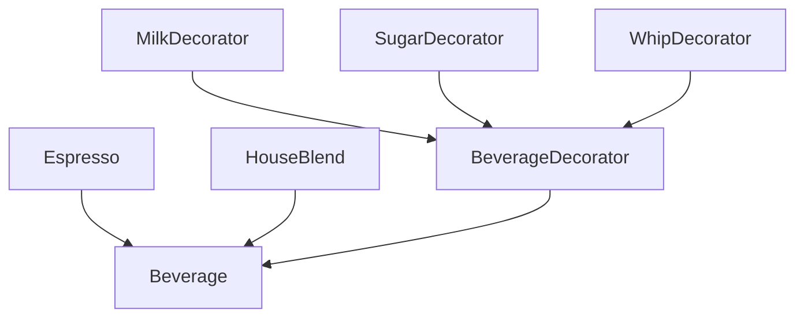

# 装饰器模式（Decorator）

## 1. UML 简图


---

## 2. 模式概述

- **分类**：结构型模式
- **意图**：在不改变原有类定义的前提下，动态地为对象添加额外职责。
- **核心问题**：当需要按需叠加多种功能（如日志、缓存、权限校验等）时，如何避免“子类爆炸”，并支持在运行时自由组合这些功能。

装饰器模式使用“**对象包装对象**”的方式，将额外行为封装在装饰类中，并通过一条链逐层传递调用。

---

## 3. 实现要点

- **实现要点**：
  - 1）抽象出统一组件接口 `Beverage`，基础对象和装饰器都实现该接口；
  - 2）在抽象装饰器 `BeverageDecorator` 中持有一个 `std::shared_ptr<Beverage>` 成员，在实现中先调用被包装对象的方法，再在前后叠加价格和描述等附加逻辑；
  - 3）各具体装饰器（牛奶、糖、奶泡等）只关心自己增加的那一部分行为，客户端通过多层嵌套组合不同装饰器，从而在运行时自由叠加功能而无需创建大量子类。

---

## 4. 结构与角色

以“咖啡加料”为例：

- **Component（抽象构件）**：
  - 示例中的 `Beverage` 接口（或抽象类），定义 `GetCost()`、`GetDescription()` 等统一接口。

- **ConcreteComponent（具体构件）**：
  - 示例中的 `Espresso`、`HouseBlend` 等基础咖啡；
  - 提供最基础的价格和描述。

- **Decorator（装饰抽象类）**：
  - 持有一个 `Beverage*` 或智能指针；
  - 对外实现相同接口，通过内部持有的组件对象转发调用，然后在前后增加行为。

- **ConcreteDecorator（具体装饰）**：
  - 示例中的 `MilkDecorator`、`SugarDecorator` 等；
  - 在 `GetCost()` 中叠加价格，在 `GetDescription()` 中追加文字说明。

通过多层装饰，客户端可以按需组合出“牛奶 + 糖 + 奶泡”这样的饮品，而无需为每种组合创建一个子类。

---

## 5. 本目录代码结构说明

- `Decorator.h`：
  - 定义 `Beverage` 抽象类；
  - 定义基础饮料 `Espresso`、`HouseBlend`；
  - 定义抽象装饰器 `BeverageDecorator` 以及多个具体装饰器（牛奶、糖、奶泡）；
  - **示例 3：线程安全的装饰器**（C++17+）
    - 使用 `std::shared_mutex` 实现线程安全的装饰器
    - 带缓存优化的装饰器（双重检查锁定）
  - 提供演示函数：
    - `RunSimpleDecoratorDemo()`：演示为一杯咖啡动态添加多种配料；
    - `RunMultipleBaseDemo()`：演示不同基础咖啡搭配不同装饰器组合；
    - `RunThreadSafeDecoratorDemo()`：演示线程安全的装饰器。
- `main.cpp`：
  - 只负责调用上述演示函数。

---

## 6. 线程安全与性能优化

### 6.1 线程安全问题分析

装饰器模式的线程安全问题：

1. **装饰器链的并发访问**
   - 多个线程同时调用装饰器方法
   - 如果装饰器有状态（如缓存），需要保护

2. **多个线程同时添加装饰器**
   - 动态构建装饰器链时的竞态条件
   - 通常装饰器构建在单线程环境完成

3. **装饰器内部状态的线程安全**
   - 带缓存的装饰器需要同步
   - 计数器等状态需要原子操作

### 6.2 线程安全实现方案

#### 方案1：读写锁 + 缓存优化

```cpp
class CachedDecorator : public Decorator {
public:
    double GetCost() const override {
        // 先尝试读锁获取缓存
        {
            std::shared_lock<std::shared_mutex> readLock(mutex_);
            if (cached_) return cachedCost_;
        }
        
        // 缓存未命中，使用写锁计算并缓存
        std::unique_lock<std::shared_mutex> writeLock(mutex_);
        if (!cached_) { // 双重检查
            cachedCost_ = base_->GetCost() + extraCost_;
            cached_ = true;
        }
        return cachedCost_;
    }
    
private:
    mutable std::shared_mutex mutex_;
    mutable bool cached_{false};
    mutable double cachedCost_{0.0};
};
```

**优点**：
- 缓存命中时只需要读锁，性能高
- 双重检查锁定避免重复计算
- 适合计算成本高的场景

#### 方案2：不可变装饰器（推荐）

```cpp
// 装饰器设计为不可变，无需同步
class ImmutableDecorator : public Decorator {
public:
    ImmutableDecorator(std::shared_ptr<Component> base, double extra)
        : base_(std::move(base))
        , extraCost_(extra) {}
    
    double GetCost() const override {
        return base_->GetCost() + extraCost_; // 线程安全
    }
    
private:
    const std::shared_ptr<Component> base_;
    const double extraCost_;
};
```

**优点**：
- 无状态设计，天然线程安全
- 性能最优，无锁开销
- 适合大多数场景

### 6.3 性能优化建议

1. **装饰器设计为无状态**
   - 无状态装饰器不需要同步
   - 可以安全地在多线程中共享

2. **缓存计算结果**
   - 对于计算成本高的操作
   - 使用读写锁 + 双重检查锁定
   - 优先用读锁获取缓存

3. **装饰器对象池**
   ```cpp
   // 复用常用装饰器
   class DecoratorPool {
   public:
       static std::shared_ptr<Decorator> GetDecorator(
           const std::string& type,
           std::shared_ptr<Component> base) {
           // 从池中获取或创建装饰器
       }
   };
   ```

4. **减少装饰器层数**
   - 过多层装饰器会影响性能
   - 考虑合并多个装饰器

### 6.4 C++ 标准版本特性

#### C++11
- ✅ `std::shared_ptr` 管理装饰器链
- ✅ `std::mutex`、`std::lock_guard`
- ✅ 移动语义优化对象传递
- ✅ Lambda 表达式

#### C++14
- ✅ `std::make_unique`
- ✅ 泛型 lambda

#### C++17
- ✅ **std::shared_mutex**（读写锁）
  ```cpp
  std::shared_lock<std::shared_mutex> readLock(mutex_);  // 读锁
  std::unique_lock<std::shared_mutex> writeLock(mutex_); // 写锁
  ```
- ✅ `std::optional` 用于可选装饰
- ✅ 结构化绑定

#### C++20
- ✅ **Concepts** 约束装饰器接口
  ```cpp
  template<typename T>
  concept BeverageType = requires(const T& t) {
      { t.GetCost() } -> std::convertible_to<double>;
      { t.GetDescription() } -> std::convertible_to<std::string>;
  };
  ```
- ✅ 协程实现异步装饰
- ✅ 模块系统

#### C++23
- ✅ `std::expected` 错误处理
- ✅ 模式匹配优化

---

## 7. 多种用法与设计思想

### 7.1 叠加多个装饰

在 `RunSimpleDecoratorDemo()` 中：

- 先创建一杯基础的 `Espresso`；
- 使用 `MilkDecorator` 包装一次，再用 `SugarDecorator` 再包装一次；
- 调用最外层对象的 `GetCost()` 与 `GetDescription()`，即可看到叠加后的价格和说明。

### 7.2 不同基础组件 + 不同装饰组合

在 `RunMultipleBaseDemo()` 中：

- 演示 `HouseBlend` 加奶加糖，和 `Espresso` 只加奶泡等不同组合；
- 所有组合都通过“包装链”构造，不需要额外的子类。

---

## 8. 典型适用场景

- I/O 流处理中，用装饰器给输入/输出流叠加缓冲、压缩、加密等功能；
- GUI 组件中，为控件添加滚动条、边框、高亮等视觉装饰；
- 业务逻辑中，动态添加日志、缓存、权限验证等横切逻辑（与责任链/代理等模式结合使用）。

---

## 9. 如何运行本示例

```bash
cd DesignPatterns/structural/decorator

# 使用 g++ 手动编译
g++ -std=c++17 -O2 -Wall -Wextra main.cpp -o decorator_example
./decorator_example

# 或在工程根目录使用 CMake 统一构建，然后运行
#   build/decorator_example
```

## 10. 运行结果示例

```
--- Simple Decorator Demo ---
Espresso, Milk, Sugar costs 13 RMB

--- Multiple Base Decorator Demo ---
House Blend, Milk, Sugar costs 11 RMB
Espresso, Whip costs 13 RMB
```

## 11. 测试用例

本装饰器模式包含以下测试用例：

- `test_decorator.cpp`：测试基本装饰器和线程安全装饰器
- 验证装饰器链的正确性
- 测试多重装饰的叠加效果
- 验证线程安全的装饰器行为

运行测试：
```bash
# 在项目根目录运行
./scripts/run_tests.sh
# 或运行特定测试
./build/decorator_test
```
