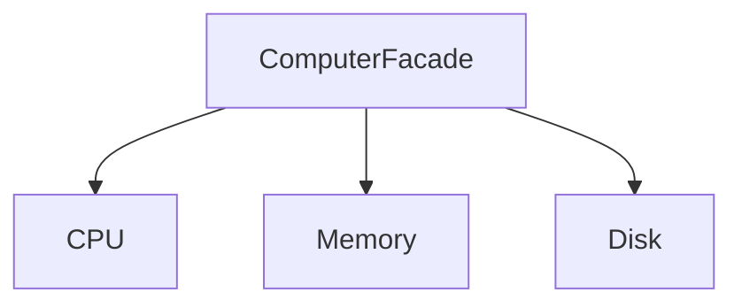

# 外观模式（Facade）

## 1. UML 简图


---

## 2. 模式概述

- **分类**：结构型模式
- **意图**：为复杂子系统提供一个统一的高层接口，使得子系统更容易使用。
- **核心问题**：当系统由许多细粒度类组成、调用顺序复杂时，如何给客户端提供一个“简单易用的一键操作入口”。

外观模式不会限制你直接使用子系统类，但鼓励在大多数场景通过外观类来完成常见任务，从而降低耦合、减少重复代码。

---

## 3. 实现要点

- **实现要点**：
  - 1）保持子系统类 `CPU`、`Memory`、`Disk` 等各自职责单一，只专注于底层操作；
  - 2）在外观类中组合这些子系统实例，并在 `Start()` / `WatchMovie()` 等高层接口中按照固定顺序调用它们，封装好完整的使用流程；
  - 3）客户端优先依赖外观类，对大部分常见场景通过一两行外观调用完成操作，如有特殊需求仍可直接访问子系统，从而在“易用性”和“灵活性”之间取得平衡。

---

## 4. 结构与角色

- **Subsystem classes（子系统类）**：
  - 各种复杂组件，例如 CPU、内存、硬盘，或者放大器、DVD 播放器、投影仪等；
  - 本身可以被独立使用，完成具体的底层操作。

- **Facade（外观类）**：
  - 封装常见的使用场景，将多个子系统调用组合成几个简单的高层接口；
  - 典型方法如 `Start()`、`Shutdown()`、`WatchMovie()` 等。

客户端只需要依赖 Facade，而不必了解子系统内部的细节和调用顺序。

---

## 5. 本目录代码结构说明

- `Facade.h`：
  - 示例 1（计算机启动/关机）：
    - 子系统类：`CPU`、`Memory`、`Disk`；
    - 外观类：`ComputerFacade`，提供 `Start()` 与 `Shutdown()`；
  - 示例 2（家庭影院）：
    - 子系统类：`Amplifier`、`DvdPlayer`、`Projector`、`TheaterLights`；
    - 外观类：`HomeTheaterFacade`，提供 `WatchMovie()` 与 `EndMovie()`；
  - 提供演示函数：`RunComputerFacadeDemo()` 和 `RunHomeTheaterFacadeDemo()`。
- `main.cpp`：
  - 只负责调用上述两个演示函数。

---

## 6. 多种用法与设计思想

### 6.1 计算机启动/关机外观

- 子系统类分别负责：
  - CPU 自检、执行指令；
  - Memory 加载/释放数据；
  - Disk 读写硬盘；
- `ComputerFacade::Start()` 内部按正确顺序依次调用各子系统，客户端只需一行代码即可完成启动流程；
- `ComputerFacade::Shutdown()` 封装关机时需要执行的资源释放步骤。

### 6.2 家庭影院外观

- 子系统类分别负责：
  - Amplifier 设置音量、音效；
  - DvdPlayer 播放/停止电影；
  - Projector 打开投影、切换模式；
  - TheaterLights 调暗/恢复灯光；
- `HomeTheaterFacade::WatchMovie()` 封装一系列操作：调灯光、打开投影、启用功放、播放 DVD；
- `HomeTheaterFacade::EndMovie()` 则负责关闭所有设备并恢复灯光。

这两个示例展示了外观模式在“系统启动/关闭流程简化”和“业务场景一键执行”上的典型用法。

---

## 7. 典型适用场景

- 为复杂库/模块提供易用的包装接口（例如图形渲染引擎、网络栈等）；
- 旧系统重构，希望在保持旧接口的同时对内部结构进行拆分和优化；
- 为上层业务代码屏蔽底层实现细节，降低耦合，简化调用代码。

---

## 8. 如何运行本示例

```bash
cd DesignPatterns/structural/facade

# 使用 g++ 手动编译
g++ -std=c++17 -O2 -Wall -Wextra main.cpp -o facade_example
./facade_example

# 或在工程根目录使用 CMake 统一构建，然后运行
#   build/facade_example
```

## 9. 运行结果示例

```

[ComputerFacade] Start computer
CPU: power on
Disk: read boot sector
Memory: load data
CPU: execute instructions

[ComputerFacade] Shutdown computer
Memory: release data
Disk: stop spinning
CPU: power off

[HomeTheaterFacade] Get ready to watch a movie
TheaterLights: dim lights
Projector: on
Amplifier: on
Amplifier: set volume to 20
DvdPlayer: on
DvdPlayer: play movie 'Design Patterns: The Movie'

[HomeTheaterFacade] Shutting movie theater down
DvdPlayer: stop
DvdPlayer: off
Amplifier: off
Projector: off
TheaterLights: lights on
```

## 10. 测试用例

本外观模式包含以下测试用例：

- `test_facade.cpp`：测试计算机和家庭影院外观
- 验证子系统协调工作的正确性
- 测试高层接口的封装功能
- 验证一键操作的便利性

运行测试：
```bash
# 在项目根目录运行
./scripts/run_tests.sh
# 或运行特定测试
./build/facade_test
```
