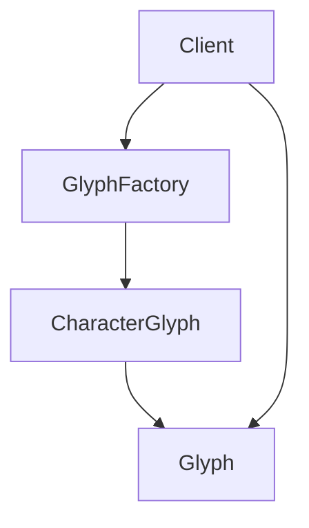

# 享元模式（Flyweight）

## 1. UML 简图


---

## 2. 模式概述

- **分类**：结构型模式
- **意图**：运用共享技术有效地支持大量细粒度对象，避免重复存储相同状态，降低内存占用。
- **核心问题**：当对象数量巨大且其中存在大量重复内部状态时，如何通过“共享”来减少内存开销。

享元模式将对象状态拆分为：
- **内部状态（Intrinsic State）**：可以被多个对象共享、不随环境改变的部分；
- **外部状态（Extrinsic State）**：依赖于具体场景、不能共享的部分，由客户端在使用时传入。

---

## 3. 实现要点

- **实现要点**：
  - 1）在享元类 `CharacterGlyph` 中只保存可共享的内部状态（如字符本身、字体信息等），不保存位置等外部状态；
  - 2）通过 `GlyphFactory` 维护一个从 key（字符）到享元对象的缓存表，多次请求同一 key 时返回同一个共享实例；
  - 3）客户端在调用 `Draw(x, y)` 等方法时，把坐标等外部状态作为参数传入，从而避免在每个享元对象中重复存储外部状态，达到节省内存的目的。

---

## 4. 结构与角色

以“文字渲染中的字符”为例：

- **Flyweight（享元接口）**：
  - 示例中的 `Glyph` 抽象类，声明 `Draw(int x, int y)` 等方法；

- **ConcreteFlyweight（具体享元）**：
  - 示例中的 `CharacterGlyph`：
    - 内部状态：字符本身（如 'a'、'b'）、字体信息等；
    - 外部状态：绘制位置 `(x, y)`，由客户端在调用 `Draw` 时传入；

- **FlyweightFactory（享元工厂）**：
  - 负责根据 key（如字符）缓存和复用 `CharacterGlyph` 实例；
  - 保证同一个字符只创建一个共享实例。

---

## 5. 本目录代码结构说明

- `Flyweight.h`：
  - 定义 `Glyph` 抽象类和 `CharacterGlyph` 具体享元；
  - 定义 `GlyphFactory` 享元工厂，内部用 `std::unordered_map` 缓存字符 → 享元对象；
  - 提供两个演示函数：
    - `RunFlyweightBasicDemo()`：多次请求同一字符，验证共享效果；
    - `RunFlyweightTextRenderDemo()`：模拟绘制字符串，展示内部/外部状态拆分。
- `main.cpp`：
  - 只负责调用上述两个演示函数。

---

## 6. 多种用法与设计思想

### 6.1 基础共享示例

在 `RunFlyweightBasicDemo()` 中：

- 从 `GlyphFactory` 多次请求同一个字符的 `Glyph`（如 'A'）；
- 打印每次获得的指针地址，观察是否为同一个对象；
- 说明“内部状态（字符本身）被共享，而外部状态（位置）由调用时指定”。

### 6.2 字符串渲染示例

在 `RunFlyweightTextRenderDemo()` 中：

- 模拟渲染一行文本，例如 "ABABA"；
- 对其中每个字符，从工厂获取享元对象，并传入不同的 `(x, y)` 坐标；
- 输出中可以看到：
  - 字母 'A' 对应的 `CharacterGlyph` 只创建一次，却被多次绘制在不同位置；
  - 外部状态不存储在享元内部，而是调用时传入。

---

## 7. 典型适用场景

- 文本编辑器/渲染引擎中的字符/字体对象；
- 游戏中的地图元素、棋子、粒子等大量重复对象；
- 图标库、GUI 控件皮肤等需要大量共享资源的地方。

---

## 8. 如何运行本示例

```bash
cd DesignPatterns/structural/flyweight

# 使用 g++ 手动编译
g++ -std=c++17 -O2 -Wall -Wextra main.cpp -o flyweight_example
./flyweight_example

# 或在工程根目录使用 CMake 统一构建，然后运行
#   build/flyweight_example
```

## 9. 运行结果示例

```
--- Flyweight Basic Demo ---
Create CharacterGlyph for 'A'
Create CharacterGlyph for 'B'
Address of g1: 0x127605f98
Address of g2: 0x127605f98
Address of g3: 0x127605c48

--- Flyweight Text Render Demo ---
Create CharacterGlyph for 'A'
Draw 'A' at (0, 0)
Create CharacterGlyph for 'B'
Draw 'B' at (10, 0)
Draw 'A' at (20, 0)
Draw 'B' at (30, 0)
Draw 'A' at (40, 0)
```

## 10. 测试用例

本享元模式包含以下测试用例：

- `test_flyweight.cpp`：测试享元工厂和对象共享
- 验证享元对象的正确共享
- 测试内部状态和外部状态的分离
- 验证缓存机制的正确性

运行测试：
```bash
# 在项目根目录运行
./scripts/run_tests.sh
# 或运行特定测试
./build/flyweight_test
```
