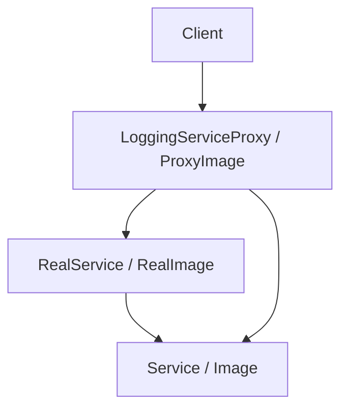

# 代理模式（Proxy）

## 1. UML 简图


---

## 2. 模式概述

- **分类**：结构型模式
- **意图**：为其他对象提供一种代理以控制对这个对象的访问。
- **核心问题**：当直接访问某个对象代价较高、或需要在访问前后附加控制逻辑时，如何在不修改原有对象的前提下实现“受控访问”。

典型形式：远程代理、虚拟代理、保护代理、缓存代理、日志代理等。

---

## 3. 实现要点

- **实现要点**：
  - 1）抽象出统一的主题接口（如 `Image`、`Service`），让真实对象与代理对象都实现该接口；
  - 2）在代理类中持有真实对象指针（可以是延迟创建），在自己的方法里先执行访问控制、懒加载、日志等横切逻辑，再转发调用到真实对象；
  - 3）客户端始终面向抽象主题编程，通过配置或工厂决定是直接使用真实对象还是使用代理，从而在不修改业务代码的前提下为对象增加各种控制逻辑。

---

## 4. 结构与角色

- **Subject（抽象主题）**：
  - 声明目标对象的统一接口，例如 `Display()`、`Request()`；

- **RealSubject（真实主题）**：
  - 负责实际的业务逻辑或资源访问；

- **Proxy（代理）**：
  - 持有一个 `RealSubject` 引用；
  - 在实现 `Subject` 接口时，可以在调用前/后增加额外控制逻辑：懒加载、访问控制、日志记录、远程通信等。

---

## 5. 本目录代码结构说明

- `Proxy.h`：
  - 示例 1：虚拟代理（Virtual Proxy）
    - `Image` 接口、`RealImage`（加载图片）、`ProxyImage`（延迟加载，首次使用时才真正加载图像）；
  - 示例 2：日志代理（Logging Proxy）
    - `Service` 接口、`RealService` 实现核心业务；
    - `LoggingServiceProxy` 在调用前后输出日志，用于调试和审计；
  - 提供演示函数：
    - `RunVirtualProxyDemo()` 和 `RunLoggingProxyDemo()`。
- `main.cpp`：
  - 只负责调用上述两个演示函数。

---

## 6. 多种用法与设计思想

### 6.1 虚拟代理：延迟加载

在 `RunVirtualProxyDemo()` 中：

- `RealImage` 在构造时模拟耗时加载；
- `ProxyImage` 内部存一个图片文件名，只有在第一次调用 `Display()` 时才真正创建 `RealImage`；
- 后续调用 `Display()` 不再触发加载，直接复用已有 `RealImage` 实例；
- 适用于“创建代价较高但不一定会用到”的资源，如大图片、数据库连接等。

### 6.2 日志代理：横切逻辑

在 `RunLoggingProxyDemo()` 中：

- `RealService` 实现业务方法 `DoWork()`；
- `LoggingServiceProxy` 持有 `RealService`，在调用前后打印日志；
- 客户端只依赖 `Service` 接口，可以在不改动业务代码的前提下引入/移除日志代理；
- 适用于：调试、审计、监控等横切关注点。

---

## 7. 典型适用场景

- 远程调用：客户端通过代理对象调用远程服务（RPC/REST），代理负责网络通信；
- 虚拟资源：需要懒加载的大资源，如图片、文档、数据库连接等；
- 权限控制：通过代理在访问真实对象前进行权限校验；
- 缓存与日志：代理为真实对象增加缓存、日志、统计等功能。

---

## 8. 如何运行本示例

```bash
cd DesignPatterns/structural/proxy

# 使用 g++ 手动编译
g++ -std=c++17 -O2 -Wall -Wextra main.cpp -o proxy_example
./proxy_example

# 或在工程根目录使用 CMake 统一构建，然后运行
#   build/proxy_example
```

## 9. 运行结果示例

```
--- Virtual Proxy Demo ---
First display:
RealImage: loading image from 'big_picture.png'...
RealImage: display 'big_picture.png'

Second display:
RealImage: display 'big_picture.png'

--- Logging Proxy Demo ---
[LOG] About to do task: generate-report
RealService: doing task 'generate-report'
[LOG] Finished task: generate-report
```

## 10. 测试用例

本代理模式包含以下测试用例：

- `test_proxy.cpp`：测试虚拟代理、日志代理和保护代理
- 验证代理控制访问的正确性
- 测试延迟加载功能
- 验证日志记录功能

运行测试：
```bash
# 在项目根目录运行
./scripts/run_tests.sh
# 或运行特定测试
./build/proxy_test
```
